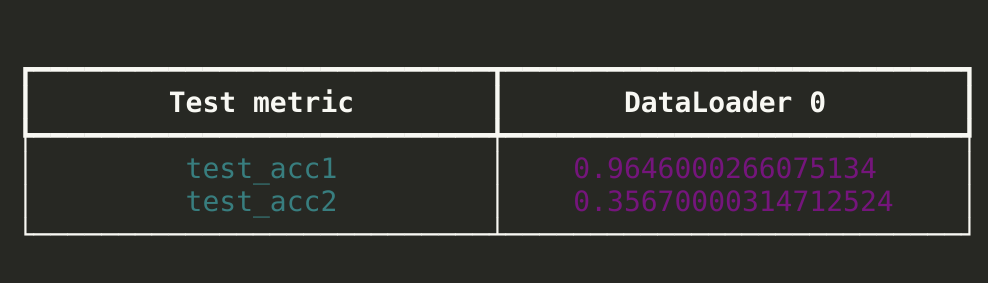

# Session 2.5

1. What is data representation?

* I didn't use a one-hot encoding for the random number, instead in the data module for MNIST, I modified it to include a random number, so this was my input (img, ano), target. Where ano is the random number

2. What is data generation strategy?

* In the pytorch lightning data module, I added a custom dataset module, and in the __getitem__ method, I added ano = torch.randint(0, 10, (1,)) to generate a random number between 0 and 10. and returned (img, ano), target in the __getitem__ method.

3. How did I combine the two inputs?

* In the second last layer of the convolutional network(MNIST prediction label) I've a fully connected layer with in-features 256 and out-features as 128, I concatenated the output of this layer with the output of the fully connected layer of the with input as random number, and then passed it through a final fully connected layer with in-features 256 and out-features as 2.
* So the output of this layer is a 2D tensor with 2 features, which is the predicted label and the sum of the random number and the predicted label.

4. How did I evaluate my results?

* I used the accuracy metric to evaluate my results.
* I used the accuracy metric for the MNIST prediction label and the sum of the random number and the predicted label.
* For latter I converted the predicted sum to int and then used the accuracy metric.

5. What results did I get?

* I got an accuracy of 0.98 for the MNIST prediction label and 0.40 for the sum of the random number and the predicted label.
* 

6. What loss function did I pick and why?

* I used a custom loss function, in which the first value was used to compute the cross entropy loss for the MNIST prediction label and the mean squared error loss for the sum of the random number and the predicted label.
* I used cross-entropy loss for the MNIST prediction label because it is a classification problem and mean squared error loss for the sum of the random number and the predicted label because it is a regression problem.

7. Training on GPU

* I used the GPU for training.
