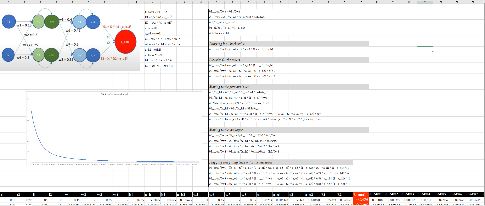

# Session 4

### Step 1

Part-1 Setup and Skeleton
Target: 98%

Explanation for the Target: This is the base skeleton of the model, intention is to just have a working skeleton. This model has a more than a million params. It comprises of a series of convolutional block with 2 max-pooling layer. It also uses fully-connected layer. Again intention is to just have a working skeleton. We will optimize the model in the next iteration. 

Result:

Max Training Accuracy: 99.57%

Max Validation Accuracy: 98.80%

Parameters: 31k+

Analysis:

As we can see, the model is clearly over-fitting. Our training accuracy is quite more than our test, we also have million+ parameters. We will need to reduce the parameters and optimize the model.

[Colab Link](https://colab.research.google.com/drive/18eMJDlIqR2clM0plE6VAYvPvaEqXBFzV?usp=sharing)

Model Structure:

Logs:

### Step 2

Part-2 Adding BatchNormalization and DropOut

Target: 99%

Explanation for the Target: Intention is to reduce the parameteres and also add dropout and batch-normalization to the model. This should reduce the over-fitting and also improve the accuracy. I'm adding dropout to every layer, except the last layer. I'm also adding batch-normalization to every layer. 99% test accuracy should be feasible now. 

Result:

Max Training Accuracy: 99.47%

Max Validation Accuracy: 99.45%

Paramteres: 31K

Analysis: The key problem with this iteration of model is, that the validation accuracy isn't consistnetly 99.45%, it's sometimes dropping to 99.3%, which is a problem. We will need to address this in the next iteration. Besides, the number of parameter is still a little high, we will need to reduce it further.

[Colab Link](https://colab.research.google.com/drive/1WIUkq2QsaFbVQl9_J7vHp-TFq9DFlBex?usp=sharing)

Model Structure:

Logs:

### Step 3

Target: 99.4% validation accuracy

Explanation for the Target: In this iteration, we will be introducing Global Average Pooling to the model in order to improve its performance. The previous iteration showed that the model was underfitting, which may have been caused by the inclusion of batch normalization and dropout layers. To address this, we will be reducing the dropout rate to 0.05. Furthermore, the last model had some unused capacity for parameters, we will be increasing the number of parameters slightly to make use of this capacity. Our goal is to achieve the final targeted accuracy for this assignment.

Result:

Max Training Accuracy: 99.44%

Max Validation Accuracy: 99.38%

Parameters: 10.2k

Analysis: Model consistently hits 99.4% in the last epochs, we can say that we've achieved our target

[Colab Link](https://colab.research.google.com/drive/11o5ycvWOV44hradfSaWkifAhlEOXCYCx?usp=sharing)

Model Structure:

Logs:

# Session 3

[Session 3 README file](S3/README.md)

### PART 1

### PART 2

I got 99.39% validation accuracy

[Here&#39;s the notebook](EVA4_Session_3.ipynb)

### Explanation of model architecture - for 12 year olds ;)

This is a model for recognizing pictures of objects. It's made up of many small parts that work together.

First, the model takes an image, and it uses a special type of math called 'convolution' to look at small parts of the image at a time. This is done by the conv1 and conv2 layers.

Then, the model looks at the image again, but this time it groups up similar parts together, this is done by the pool1 and pool2 layers.

After that, the model makes sure that it doesn't get too excited by some specific parts of the image, this is done by dropout layer.

Then the model looks at the image again, but this time it uses another type of math called 'convolution' to look at the image in a different way, this is done by conv6 layer.

Then, the model looks at the image again but this time it takes the average of all the parts, this is done by avgpool layer.

Finally, the model uses a simple math to decide which object the image is showing, this is done by the fc layer.

To simplify, this model is composed of several layers that each one of them performs a specific task such as convolution, pooling, batch normalization, dropout and linear layers, these layers work together to recognize the objects in the images and output the class of the object.

# Session 2.5
[Session 2.5 README](S2.5/README.md)

1. What is data representation?

* I didn't use a one-hot encoding for the random number, instead in the data module for MNIST, I modified it to include a random number, so this was my input (img, ano), target. Where ano is the random number

2. What is data generation strategy?

* In the pytorch lightning data module, I added a custom dataset module, and in the __getitem__ method, I added ano = torch.randint(0, 10, (1,)) to generate a random number between 0 and 10. and returned (img, ano), target in the __getitem__ method.

3. How did I combine the two inputs?

* In the second last layer of the convolutional network(MNIST prediction label) I've a fully connected layer with in-features 256 and out-features as 128, I concatenated the output of this layer with the output of the fully connected layer of the with input as random number, and then passed it through a final fully connected layer with in-features 256 and out-features as 2.
* So the output of this layer is a 2D tensor with 2 features, which is the predicted label and the sum of the random number and the predicted label.

4. How did I evaluate my results?

* I used the accuracy metric to evaluate my results.
* I used the accuracy metric for the MNIST prediction label and the sum of the random number and the predicted label.
* For latter I converted the predicted sum to int and then used the accuracy metric.

5. What results did I get?

* I got an accuracy of 0.98 for the MNIST prediction label and 0.40 for the sum of the random number and the predicted label.
* 

6. What loss function did I pick and why?

* I used a custom loss function, in which the first value was used to compute the cross entropy loss for the MNIST prediction label and the mean squared error loss for the sum of the random number and the predicted label.
* I used cross-entropy loss for the MNIST prediction label because it is a classification problem and mean squared error loss for the sum of the random number and the predicted label because it is a regression problem.

7. Training on GPU

* I used the GPU for training.

8. Logs: Used pytorch lightning, so I've the logs in tensorboard.

https://tensorboard.dev/experiment/9aoGDYKyRCOTnKuA3p732Q/#scalars&_smoothingWeight=0.999

test_acc1 is pretty close to 1, which is the accuracy for the MNIST prediction label.

Likewise it's pretty close to 0.4, which is the accuracy for the sum of the random number and the predicted label.

Finally the loss for both mnist prediction label and prediction of the sum, loss is sum of the cross entropy loss and mean squared error loss.

More details are on the link.
