# Youtube Video
[Link to Video](https://youtu.be/MNGXXRh8tpI)

# Custom 16 images

<!-- Add 16 images from the folder custom_images, in a 4x4 grid -->

  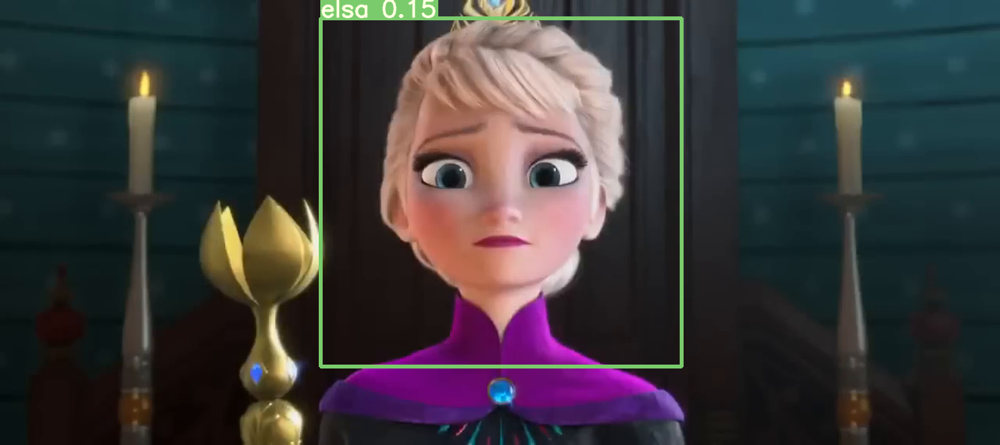
  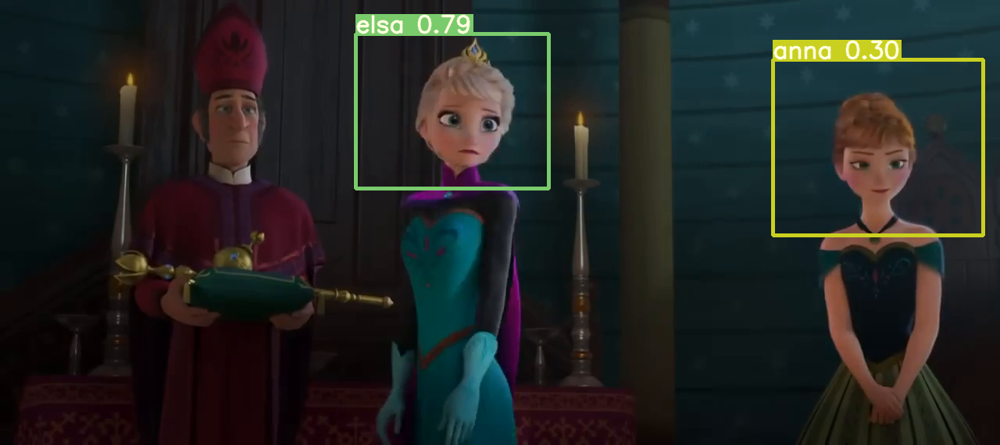
  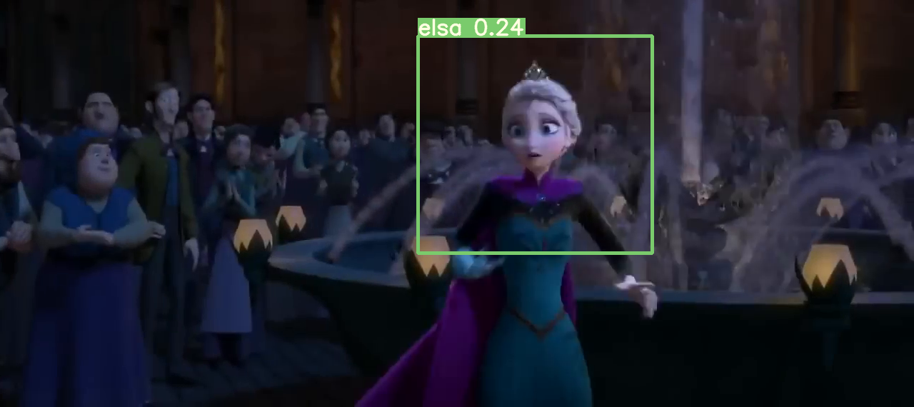
  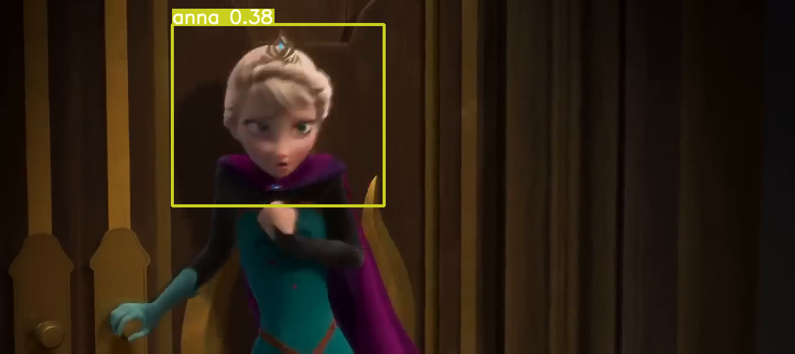

  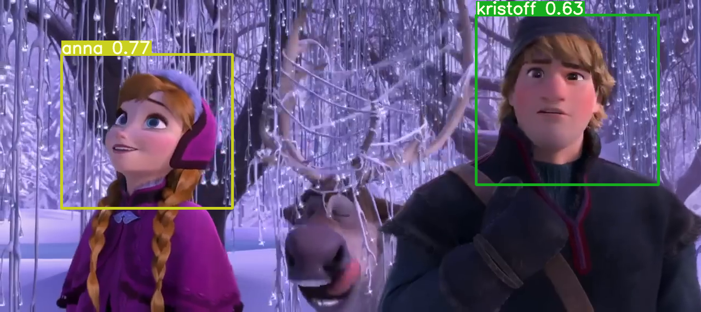
  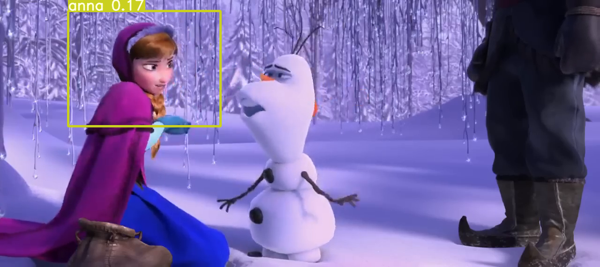
  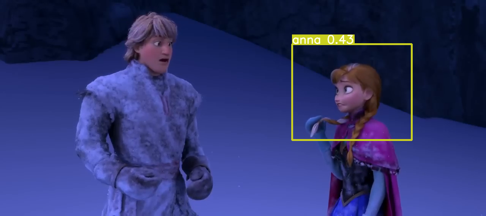
  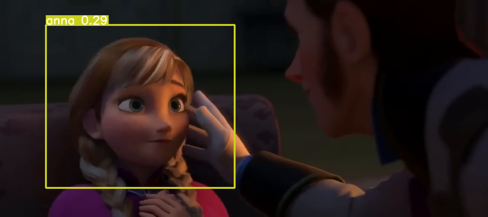

  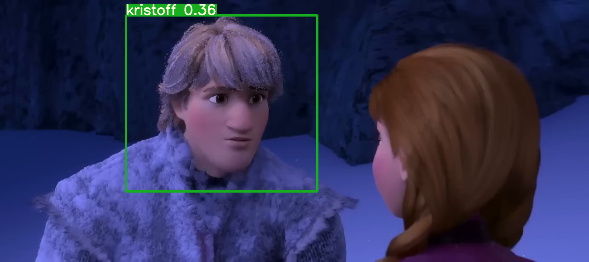
  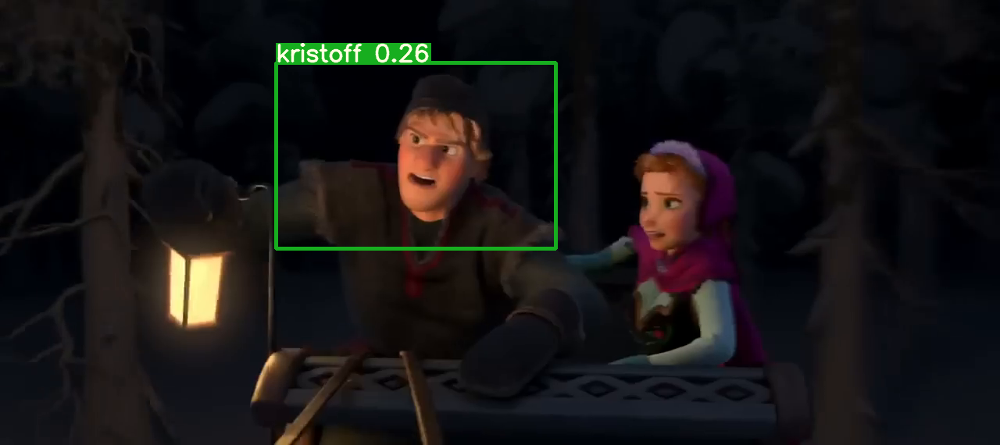
  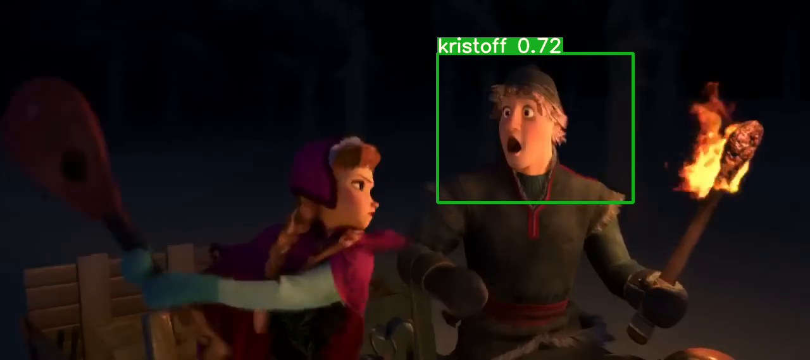
  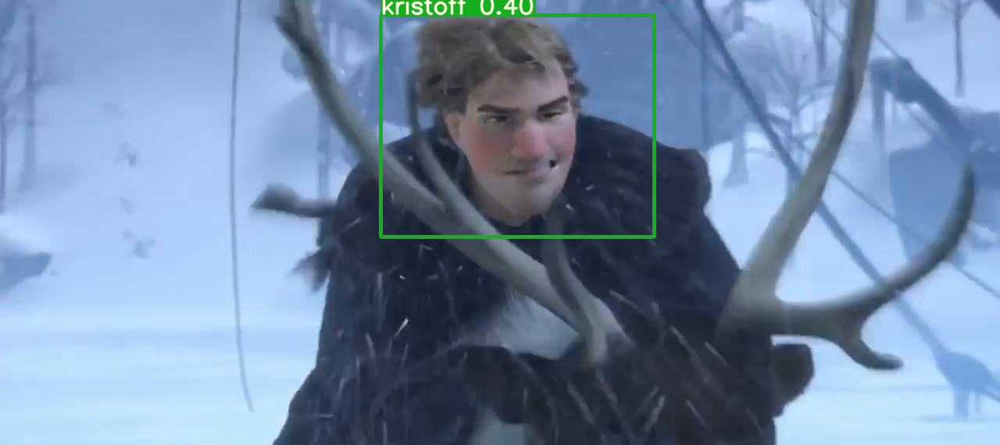

  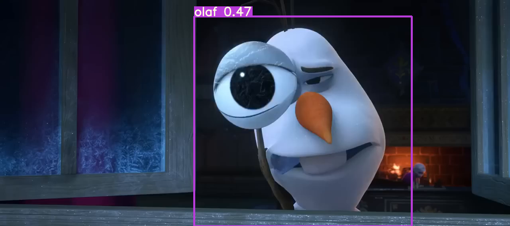
  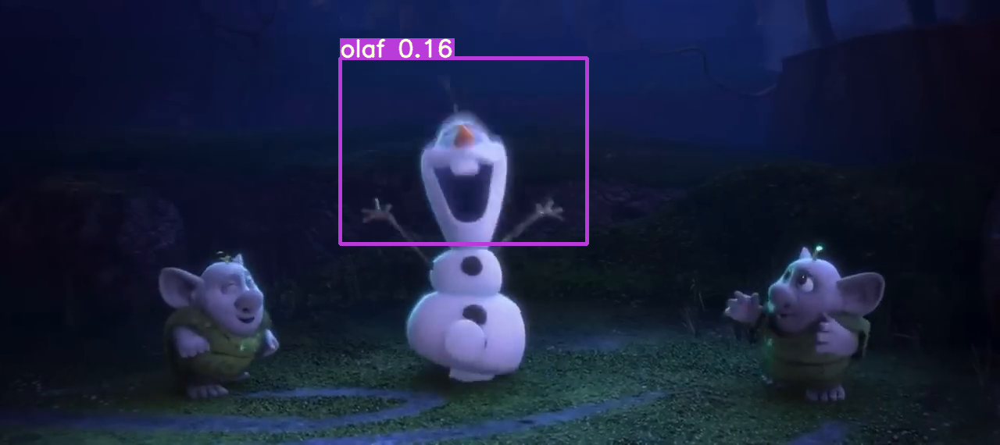
  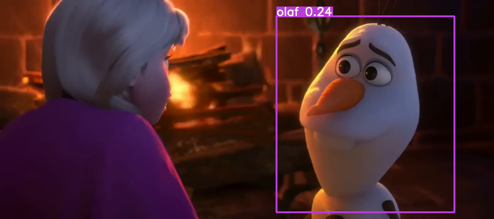
  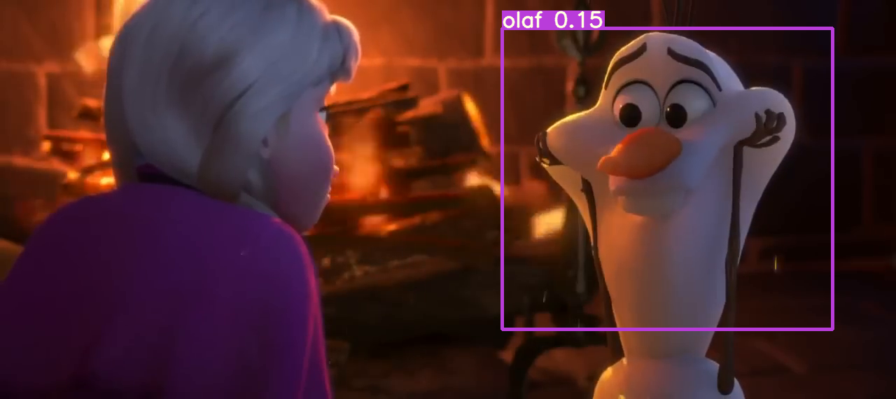

# Training Logs

(mlo) 🍎/~/Documents/learn/tsai/eva_8/yolov3:$ python train.py --data data/customdata/custom.data --batch 20 --cache --cfg cfg/yolov3-custom.cfg --epochs 300 --nosave
Namespace(epochs=300, batch_size=20, accumulate=4, cfg='cfg/yolov3-custom.cfg', data='data/customdata/custom.data', multi_scale=False, img_size=[512], rect=False, resume=False, nosave=True, notest=False, evolve=False, bucket='', cache_images=True, weights='weights/yolov3-spp-ultralytics.pt', name='', device='', adam=False, single_cls=False)
Using CUDA device0 _CudaDeviceProperties(name='NVIDIA GeForce RTX 3080 Laptop GPU', total_memory=16116MB)

Run 'tensorboard --logdir=runs' to view tensorboard at http://localhost:6006/
WARNING: smart bias initialization failure.
WARNING: smart bias initialization failure.
WARNING: smart bias initialization failure.
Model Summary: 225 layers, 6.25895e+07 parameters, 6.25895e+07 gradients
Caching labels (304 found, 0 missing, 58 empty, 0 duplicate, for 362 images): 100%|██████████████████████████████████████████████████████████████████████████████████████| 362/362 [00:00<00:00, 8682.42it/s]
Caching images (0.2GB): 100%|█████████████████████████████████████████████████████████████████████████████████████████████████████████████████████████████████████████████| 362/362 [00:00<00:00, 472.63it/s]
Caching labels (304 found, 0 missing, 58 empty, 0 duplicate, for 362 images): 100%|█████████████████████████████████████████████████████████████████████████████████████| 362/362 [00:00<00:00, 20676.79it/s]
Caching images (0.2GB): 100%|█████████████████████████████████████████████████████████████████████████████████████████████████████████████████████████████████████████████| 362/362 [00:00<00:00, 389.76it/s]
Image sizes 512 - 512 train, 512 test
Using 8 dataloader workers
Starting training for 300 epochs...

     Epoch   gpu_mem      GIoU       obj       cls     total   targets  img_size
  0%|                                                                                                                                                                                 | 0/19 [00:00<?, ?it/s]/home/shivam13juna/Documents/virtual_envs/mlo/lib/python3.10/site-packages/torch/cuda/memory.py:384: FutureWarning: torch.cuda.memory_cached has been renamed to torch.cuda.memory_reserved
  warnings.warn(
     0/299     14.1G      6.33      30.9      3.51      40.8         2       512: 100%|██████████████████████████████████████████████████████████████████████████████████████| 19/19 [00:16<00:00,  1.13it/s]
/home/shivam13juna/Documents/virtual_envs/mlo/lib/python3.10/site-packages/torch/functional.py:568: UserWarning: torch.meshgrid: in an upcoming release, it will be required to pass the indexing argument. (Triggered internally at  ../aten/src/ATen/native/TensorShape.cpp:2228.)
  return _VF.meshgrid(tensors, **kwargs)  # type: ignore[attr-defined]
               Class    Images   Targets         P         R   mAP@0.5        F1: 100%|██████████████████████████████████████████████████████████████████████████████████████| 19/19 [00:05<00:00,  3.43it/s]
                 all       362       336         0         0  0.000259         0

     Epoch   gpu_mem      GIoU       obj       cls     total   targets  img_size
     1/299     14.1G      5.53      2.71      3.28      11.5         4       512: 100%|██████████████████████████████████████████████████████████████████████████████████████| 19/19 [00:14<00:00,  1.34it/s]
               Class    Images   Targets         P         R   mAP@0.5        F1: 100%|██████████████████████████████████████████████████████████████████████████████████████| 19/19 [00:03<00:00,  4.88it/s]
                 all       362       336         0         0         0         0

     Epoch   gpu_mem      GIoU       obj       cls     total   targets  img_size
     2/299     14.1G      4.49      3.24      2.77      10.5         3       512: 100%|██████████████████████████████████████████████████████████████████████████████████████| 19/19 [00:14<00:00,  1.32it/s]
               Class    Images   Targets         P         R   mAP@0.5        F1: 100%|██████████████████████████████████████████████████████████████████████████████████████| 19/19 [00:04<00:00,  4.56it/s]
                 all       362       336      0.25   0.00342    0.0415   0.00676

     Epoch   gpu_mem      GIoU       obj       cls     total   targets  img_size
     3/299     14.1G      4.45      2.93      2.78      10.2         2       512: 100%|██████████████████████████████████████████████████████████████████████████████████████| 19/19 [00:14<00:00,  1.32it/s]
               Class    Images   Targets         P         R   mAP@0.5        F1: 100%|██████████████████████████████████████████████████████████████████████████████████████| 19/19 [00:04<00:00,  4.43it/s]
                 all       362       336     0.142    0.0982    0.0808     0.103

     Epoch   gpu_mem      GIoU       obj       cls     total   targets  img_size
     4/299     14.1G      4.84      2.26      2.69      9.79         3       512: 100%|██████████████████████████████████████████████████████████████████████████████████████| 19/19 [00:14<00:00,  1.32it/s]
               Class    Images   Targets         P         R   mAP@0.5        F1: 100%|██████████████████████████████████████████████████████████████████████████████████████| 19/19 [00:04<00:00,  3.97it/s]
                 all       362       336    0.0219     0.844     0.108    0.0427

     Epoch   gpu_mem      GIoU       obj       cls     total   targets  img_size
     5/299     14.1G      5.29       1.7      2.86      9.85         4       512: 100%|██████████████████████████████████████████████████████████████████████████████████████| 19/19 [00:14<00:00,  1.32it/s]
               Class    Images   Targets         P         R   mAP@0.5        F1: 100%|██████████████████████████████████████████████████████████████████████████████████████| 19/19 [00:04<00:00,  4.03it/s]
                 all       362       336    0.0346     0.693     0.101    0.0659

     Epoch   gpu_mem      GIoU       obj       cls     total   targets  img_size
     6/299     14.1G       4.6      1.42      2.74      8.76         4       512: 100%|██████████████████████████████████████████████████████████████████████████████████████| 19/19 [00:14<00:00,  1.33it/s]
               Class    Images   Targets         P         R   mAP@0.5        F1: 100%|██████████████████████████████████████████████████████████████████████████████████████| 19/19 [00:04<00:00,  3.84it/s]
                 all       362       336   0.00723     0.657   0.00676    0.0143

     Epoch   gpu_mem      GIoU       obj       cls     total   targets  img_size
     7/299     14.1G         4      1.23      2.53      7.76         3       512: 100%|██████████████████████████████████████████████████████████████████████████████████████| 19/19 [00:14<00:00,  1.34it/s]
               Class    Images   Targets         P         R   mAP@0.5        F1: 100%|██████████████████████████████████████████████████████████████████████████████████████| 19/19 [00:04<00:00,  4.05it/s]
                 all       362       336     0.053     0.405    0.0497    0.0938

     Epoch   gpu_mem      GIoU       obj       cls     total   targets  img_size
     8/299     14.1G         4      1.11      2.46      7.56         1       512: 100%|██████████████████████████████████████████████████████████████████████████████████████| 19/19 [00:14<00:00,  1.34it/s]
               Class    Images   Targets         P         R   mAP@0.5        F1: 100%|██████████████████████████████████████████████████████████████████████████████████████| 19/19 [00:04<00:00,  4.39it/s]
                 all       362       336    0.0847     0.621     0.156     0.149

     Epoch   gpu_mem      GIoU       obj       cls     total   targets  img_size
     9/299     14.1G      3.69     0.977      2.46      7.12         1       512: 100%|██████████████████████████████████████████████████████████████████████████████████████| 19/19 [00:14<00:00,  1.34it/s]
               Class    Images   Targets         P         R   mAP@0.5        F1: 100%|██████████████████████████████████████████████████████████████████████████████████████| 19/19 [00:05<00:00,  3.50it/s]
                 all       362       336    0.0156     0.731    0.0273    0.0304

     Epoch   gpu_mem      GIoU       obj       cls     total   targets  img_size
    10/299     14.1G      4.09      1.06      2.53      7.67         3       512: 100%|██████████████████████████████████████████████████████████████████████████████████████| 19/19 [00:14<00:00,  1.33it/s]
               Class    Images   Targets         P         R   mAP@0.5        F1: 100%|██████████████████████████████████████████████████████████████████████████████████████| 19/19 [00:04<00:00,  4.00it/s]
                 all       362       336     0.119     0.656     0.211       0.2

     Epoch   gpu_mem      GIoU       obj       cls     total   targets  img_size
    11/299     14.1G      3.06      1.02      2.22       6.3         3       512: 100%|██████████████████████████████████████████████████████████████████████████████████████| 19/19 [00:14<00:00,  1.34it/s]
               Class    Images   Targets         P         R   mAP@0.5        F1: 100%|██████████████████████████████████████████████████████████████████████████████████████| 19/19 [00:04<00:00,  4.01it/s]
                 all       362       336    0.0915     0.529     0.129     0.138

     Epoch   gpu_mem      GIoU       obj       cls     total   targets  img_size
    12/299     14.1G      4.01      1.06      2.46      7.53         4       512: 100%|██████████████████████████████████████████████████████████████████████████████████████| 19/19 [00:14<00:00,  1.33it/s]
               Class    Images   Targets         P         R   mAP@0.5        F1: 100%|██████████████████████████████████████████████████████████████████████████████████████| 19/19 [00:04<00:00,  4.01it/s]
                 all       362       336    0.0892     0.729     0.177     0.149

     Epoch   gpu_mem      GIoU       obj       cls     total   targets  img_size
    13/299     14.1G      3.75      1.02      2.52      7.29         2       512: 100%|██████████████████████████████████████████████████████████████████████████████████████| 19/19 [00:14<00:00,  1.33it/s]
               Class    Images   Targets         P         R   mAP@0.5        F1: 100%|██████████████████████████████████████████████████████████████████████████████████████| 19/19 [00:04<00:00,  4.00it/s]
                 all       362       336    0.0719     0.416    0.0874       0.1

     Epoch   gpu_mem      GIoU       obj       cls     total   targets  img_size
    14/299     14.1G      3.67     0.931       2.2       6.8         2       512: 100%|██████████████████████████████████████████████████████████████████████████████████████| 19/19 [00:14<00:00,  1.33it/s]
               Class    Images   Targets         P         R   mAP@0.5        F1: 100%|██████████████████████████████████████████████████████████████████████████████████████| 19/19 [00:04<00:00,  4.03it/s]
                 all       362       336     0.293   0.00885    0.0282    0.0164

     Epoch   gpu_mem      GIoU       obj       cls     total   targets  img_size
    15/299     14.1G      3.92     0.981      2.41      7.32         1       512: 100%|██████████████████████████████████████████████████████████████████████████████████████| 19/19 [00:14<00:00,  1.34it/s]
               Class    Images   Targets         P         R   mAP@0.5        F1: 100%|██████████████████████████████████████████████████████████████████████████████████████| 19/19 [00:04<00:00,  3.98it/s]
                 all       362       336    0.0117    0.0259    0.0139    0.0156

     Epoch   gpu_mem      GIoU       obj       cls     total   targets  img_size
    16/299     14.1G      4.17      1.11       2.3      7.58         2       512: 100%|██████████████████████████████████████████████████████████████████████████████████████| 19/19 [00:14<00:00,  1.34it/s]
               Class    Images   Targets         P         R   mAP@0.5        F1: 100%|██████████████████████████████████████████████████████████████████████████████████████| 19/19 [00:04<00:00,  4.02it/s]
                 all       362       336     0.264     0.189     0.173     0.218

     Epoch   gpu_mem      GIoU       obj       cls     total   targets  img_size
    17/299     14.1G      3.62     0.939      2.14       6.7         2       512: 100%|██████████████████████████████████████████████████████████████████████████████████████| 19/19 [00:14<00:00,  1.33it/s]
               Class    Images   Targets         P         R   mAP@0.5        F1: 100%|██████████████████████████████████████████████████████████████████████████████████████| 19/19 [00:04<00:00,  4.03it/s]
                 all       362       336     0.437    0.0837     0.297     0.139

     Epoch   gpu_mem      GIoU       obj       cls     total   targets  img_size
    18/299     14.1G       3.9      0.98      2.28      7.15         4       512: 100%|██████████████████████████████████████████████████████████████████████████████████████| 19/19 [00:14<00:00,  1.33it/s]
               Class    Images   Targets         P         R   mAP@0.5        F1: 100%|██████████████████████████████████████████████████████████████████████████████████████| 19/19 [00:04<00:00,  4.02it/s]
                 all       362       336     0.331     0.449     0.314     0.202

     Epoch   gpu_mem      GIoU       obj       cls     total   targets  img_size
    19/299     14.1G      3.92     0.894      2.46      7.27         3       512: 100%|██████████████████████████████████████████████████████████████████████████████████████| 19/19 [00:14<00:00,  1.33it/s]
               Class    Images   Targets         P         R   mAP@0.5        F1: 100%|██████████████████████████████████████████████████████████████████████████████████████| 19/19 [00:04<00:00,  4.03it/s]
                 all       362       336     0.285      0.15     0.246     0.164

     Epoch   gpu_mem      GIoU       obj       cls     total   targets  img_size
    20/299     14.1G      3.83     0.964      2.33      7.13         5       512: 100%|██████████████████████████████████████████████████████████████████████████████████████| 19/19 [00:14<00:00,  1.33it/s]
               Class    Images   Targets         P         R   mAP@0.5        F1: 100%|██████████████████████████████████████████████████████████████████████████████████████| 19/19 [00:04<00:00,  4.01it/s]
                 all       362       336     0.246     0.386     0.284     0.286

     Epoch   gpu_mem      GIoU       obj       cls     total   targets  img_size
    21/299     14.1G      3.38     0.817       2.1       6.3         2       512: 100%|██████████████████████████████████████████████████████████████████████████████████████| 19/19 [00:14<00:00,  1.34it/s]
               Class    Images   Targets         P         R   mAP@0.5        F1: 100%|██████████████████████████████████████████████████████████████████████████████████████| 19/19 [00:04<00:00,  4.00it/s]
                 all       362       336     0.267     0.635     0.321      0.33

     Epoch   gpu_mem      GIoU       obj       cls     total   targets  img_size
    22/299     14.1G      3.68      0.88      2.24      6.79         1       512: 100%|██████████████████████████████████████████████████████████████████████████████████████| 19/19 [00:14<00:00,  1.33it/s]
               Class    Images   Targets         P         R   mAP@0.5        F1: 100%|██████████████████████████████████████████████████████████████████████████████████████| 19/19 [00:04<00:00,  4.00it/s]
                 all       362       336     0.207     0.639     0.303     0.281

     Epoch   gpu_mem      GIoU       obj       cls     total   targets  img_size
    23/299     14.1G      3.45     0.971       2.1      6.52         3       512: 100%|██████████████████████████████████████████████████████████████████████████████████████| 19/19 [00:14<00:00,  1.33it/s]
               Class    Images   Targets         P         R   mAP@0.5        F1: 100%|██████████████████████████████████████████████████████████████████████████████████████| 19/19 [00:04<00:00,  4.02it/s]
                 all       362       336     0.246     0.336     0.245     0.266

     Epoch   gpu_mem      GIoU       obj       cls     total   targets  img_size
    24/299     14.1G      3.83      0.89      2.27      6.99         3       512: 100%|██████████████████████████████████████████████████████████████████████████████████████| 19/19 [00:14<00:00,  1.34it/s]
               Class    Images   Targets         P         R   mAP@0.5        F1: 100%|██████████████████████████████████████████████████████████████████████████████████████| 19/19 [00:04<00:00,  4.01it/s]
                 all       362       336     0.336     0.287     0.263     0.296

     Epoch   gpu_mem      GIoU       obj       cls     total   targets  img_size
    25/299     14.1G      3.28     0.891      1.95      6.12         3       512: 100%|██████████████████████████████████████████████████████████████████████████████████████| 19/19 [00:14<00:00,  1.33it/s]
               Class    Images   Targets         P         R   mAP@0.5        F1: 100%|██████████████████████████████████████████████████████████████████████████████████████| 19/19 [00:04<00:00,  4.00it/s]
                 all       362       336     0.407     0.342     0.334     0.296

     Epoch   gpu_mem      GIoU       obj       cls     total   targets  img_size
    26/299     14.1G      3.52     0.936      2.09      6.55        27       512:  32%|███████████████████████████▍                                                           | 6/19 [00:05<00:10,  1.28it/s]
Model Bias Summary:    layer        regression        objectness    classification
                          89      -0.12+/-0.26     -12.23+/-3.11      -0.78+/-0.31 
                         101       0.23+/-0.32     -12.80+/-2.33      -0.75+/-0.27 
                         113       0.18+/-0.29     -13.19+/-0.90      -0.59+/-0.78 
    26/299     14.1G      3.62     0.867      2.03      6.51         3       512: 100%|██████████████████████████████████████████████████████████████████████████████████████| 19/19 [00:14<00:00,  1.33it/s]
               Class    Images   Targets         P         R   mAP@0.5        F1: 100%|██████████████████████████████████████████████████████████████████████████████████████| 19/19 [00:04<00:00,  4.01it/s]
                 all       362       336     0.176     0.478     0.191     0.228

     Epoch   gpu_mem      GIoU       obj       cls     total   targets  img_size
    27/299     14.1G      3.55      1.06       2.2      6.81         7       512: 100%|██████████████████████████████████████████████████████████████████████████████████████| 19/19 [00:14<00:00,  1.34it/s]
               Class    Images   Targets         P         R   mAP@0.5        F1: 100%|██████████████████████████████████████████████████████████████████████████████████████| 19/19 [00:04<00:00,  3.94it/s]
                 all       362       336     0.214     0.723     0.307      0.32

     Epoch   gpu_mem      GIoU       obj       cls     total   targets  img_size
    28/299     14.1G       3.6     0.978      2.01      6.59         3       512: 100%|██████████████████████████████████████████████████████████████████████████████████████| 19/19 [00:14<00:00,  1.34it/s]
               Class    Images   Targets         P         R   mAP@0.5        F1: 100%|██████████████████████████████████████████████████████████████████████████████████████| 19/19 [00:04<00:00,  4.00it/s]
                 all       362       336     0.184     0.616     0.243     0.267

     Epoch   gpu_mem      GIoU       obj       cls     total   targets  img_size
    29/299     14.1G      3.24      1.06      2.07      6.36         4       512: 100%|██████████████████████████████████████████████████████████████████████████████████████| 19/19 [00:14<00:00,  1.33it/s]
               Class    Images   Targets         P         R   mAP@0.5        F1: 100%|██████████████████████████████████████████████████████████████████████████████████████| 19/19 [00:05<00:00,  3.74it/s]
                 all       362       336         0         0  6.18e-07         0

     Epoch   gpu_mem      GIoU       obj       cls     total   targets  img_size
    30/299     14.1G      3.74      1.05      2.26      7.04         2       512: 100%|██████████████████████████████████████████████████████████████████████████████████████| 19/19 [00:14<00:00,  1.33it/s]
               Class    Images   Targets         P         R   mAP@0.5        F1: 100%|██████████████████████████████████████████████████████████████████████████████████████| 19/19 [00:05<00:00,  3.57it/s]
                 all       362       336  7.75e-05    0.0233  1.54e-05  0.000155

     Epoch   gpu_mem      GIoU       obj       cls     total   targets  img_size
    31/299     14.1G      3.37      1.01      2.14      6.52         5       512: 100%|██████████████████████████████████████████████████████████████████████████████████████| 19/19 [00:14<00:00,  1.33it/s]
               Class    Images   Targets         P         R   mAP@0.5        F1: 100%|██████████████████████████████████████████████████████████████████████████████████████| 19/19 [00:04<00:00,  3.81it/s]
                 all       362       336  0.000364    0.0415  0.000115  0.000719

     Epoch   gpu_mem      GIoU       obj       cls     total   targets  img_size
    32/299     14.1G      3.71     0.968      2.21       6.9         2       512: 100%|██████████████████████████████████████████████████████████████████████████████████████| 19/19 [00:14<00:00,  1.33it/s]
               Class    Images   Targets         P         R   mAP@0.5        F1: 100%|██████████████████████████████████████████████████████████████████████████████████████| 19/19 [00:04<00:00,  4.01it/s]
                 all       362       336     0.356     0.109      0.15     0.164

     Epoch   gpu_mem      GIoU       obj       cls     total   targets  img_size
    33/299     14.1G      3.36     0.922      2.12       6.4         1       512: 100%|██████████████████████████████████████████████████████████████████████████████████████| 19/19 [00:14<00:00,  1.33it/s]
               Class    Images   Targets         P         R   mAP@0.5        F1: 100%|██████████████████████████████████████████████████████████████████████████████████████| 19/19 [00:04<00:00,  4.04it/s]
                 all       362       336     0.347    0.0548     0.131    0.0889

     Epoch   gpu_mem      GIoU       obj       cls     total   targets  img_size
    34/299     14.1G      3.47     0.988      2.16      6.61         4       512: 100%|██████████████████████████████████████████████████████████████████████████████████████| 19/19 [00:14<00:00,  1.33it/s]
               Class    Images   Targets         P         R   mAP@0.5        F1: 100%|██████████████████████████████████████████████████████████████████████████████████████| 19/19 [00:04<00:00,  4.10it/s]
                 all       362       336      0.25   0.00305    0.0606   0.00602

     Epoch   gpu_mem      GIoU       obj       cls     total   targets  img_size
    35/299     14.1G      3.47     0.936      2.02      6.42         2       512: 100%|██████████████████████████████████████████████████████████████████████████████████████| 19/19 [00:14<00:00,  1.33it/s]
               Class    Images   Targets         P         R   mAP@0.5        F1: 100%|██████████████████████████████████████████████████████████████████████████████████████| 19/19 [00:04<00:00,  4.07it/s]
                 all       362       336     0.276   0.00817    0.0763    0.0145

     Epoch   gpu_mem      GIoU       obj       cls     total   targets  img_size
    36/299     14.1G      3.65     0.849      2.17      6.68         1       512: 100%|██████████████████████████████████████████████████████████████████████████████████████| 19/19 [00:14<00:00,  1.34it/s]
               Class    Images   Targets         P         R   mAP@0.5        F1: 100%|██████████████████████████████████████████████████████████████████████████████████████| 19/19 [00:04<00:00,  4.03it/s]
                 all       362       336     0.394     0.295     0.329     0.304

     Epoch   gpu_mem      GIoU       obj       cls     total   targets  img_size
    37/299     14.1G       3.5     0.856      2.08      6.44         5       512: 100%|██████████████████████████████████████████████████████████████████████████████████████| 19/19 [00:14<00:00,  1.33it/s]
               Class    Images   Targets         P         R   mAP@0.5        F1: 100%|██████████████████████████████████████████████████████████████████████████████████████| 19/19 [00:04<00:00,  4.03it/s]
                 all       362       336     0.256     0.178     0.225     0.189

     Epoch   gpu_mem      GIoU       obj       cls     total   targets  img_size
    38/299     14.1G      3.11     0.894      1.87      5.88         4       512: 100%|██████████████████████████████████████████████████████████████████████████████████████| 19/19 [00:14<00:00,  1.33it/s]
               Class    Images   Targets         P         R   mAP@0.5        F1: 100%|██████████████████████████████████████████████████████████████████████████████████████| 19/19 [00:04<00:00,  4.00it/s]
                 all       362       336     0.355     0.348     0.358     0.348

     Epoch   gpu_mem      GIoU       obj       cls     total   targets  img_size
    39/299     14.1G      3.68     0.833      1.97      6.48         2       512: 100%|██████████████████████████████████████████████████████████████████████████████████████| 19/19 [00:14<00:00,  1.33it/s]
               Class    Images   Targets         P         R   mAP@0.5        F1: 100%|██████████████████████████████████████████████████████████████████████████████████████| 19/19 [00:04<00:00,  3.98it/s]
                 all       362       336     0.321     0.456     0.338     0.337

     Epoch   gpu_mem      GIoU       obj       cls     total   targets  img_size
    40/299     14.1G      3.65     0.858      2.02      6.53         4       512: 100%|██████████████████████████████████████████████████████████████████████████████████████| 19/19 [00:14<00:00,  1.33it/s]
               Class    Images   Targets         P         R   mAP@0.5        F1: 100%|██████████████████████████████████████████████████████████████████████████████████████| 19/19 [00:04<00:00,  4.03it/s]
                 all       362       336     0.444     0.531     0.442     0.471

     Epoch   gpu_mem      GIoU       obj       cls     total   targets  img_size
    41/299     14.1G      2.95     0.887      1.81      5.64         2       512: 100%|██████████████████████████████████████████████████████████████████████████████████████| 19/19 [00:14<00:00,  1.33it/s]
               Class    Images   Targets         P         R   mAP@0.5        F1: 100%|██████████████████████████████████████████████████████████████████████████████████████| 19/19 [00:04<00:00,  4.02it/s]
                 all       362       336     0.363     0.659     0.465     0.461

     Epoch   gpu_mem      GIoU       obj       cls     total   targets  img_size
    42/299     14.1G      3.74     0.808      2.05       6.6         4       512: 100%|██████████████████████████████████████████████████████████████████████████████████████| 19/19 [00:14<00:00,  1.32it/s]
               Class    Images   Targets         P         R   mAP@0.5        F1: 100%|██████████████████████████████████████████████████████████████████████████████████████| 19/19 [00:04<00:00,  4.02it/s]
                 all       362       336     0.321     0.613     0.384     0.413

     Epoch   gpu_mem      GIoU       obj       cls     total   targets  img_size
    43/299     14.1G      3.37     0.812      2.05      6.24         4       512: 100%|██████████████████████████████████████████████████████████████████████████████████████| 19/19 [00:14<00:00,  1.33it/s]
               Class    Images   Targets         P         R   mAP@0.5        F1: 100%|██████████████████████████████████████████████████████████████████████████████████████| 19/19 [00:04<00:00,  4.02it/s]
                 all       362       336     0.394      0.45     0.304     0.368

     Epoch   gpu_mem      GIoU       obj       cls     total   targets  img_size
    44/299     14.1G      3.05     0.721      1.67      5.45         2       512: 100%|██████████████████████████████████████████████████████████████████████████████████████| 19/19 [00:14<00:00,  1.33it/s]
               Class    Images   Targets         P         R   mAP@0.5        F1: 100%|██████████████████████████████████████████████████████████████████████████████████████| 19/19 [00:04<00:00,  3.99it/s]
                 all       362       336     0.312     0.708     0.377     0.407

     Epoch   gpu_mem      GIoU       obj       cls     total   targets  img_size
    45/299     14.1G      3.39     0.788      1.83         6         3       512: 100%|██████████████████████████████████████████████████████████████████████████████████████| 19/19 [00:14<00:00,  1.33it/s]
               Class    Images   Targets         P         R   mAP@0.5        F1: 100%|██████████████████████████████████████████████████████████████████████████████████████| 19/19 [00:04<00:00,  3.98it/s]
                 all       362       336     0.306     0.834     0.429     0.445

     Epoch   gpu_mem      GIoU       obj       cls     total   targets  img_size
    46/299     14.1G      3.13     0.828      1.85      5.81         4       512: 100%|██████████████████████████████████████████████████████████████████████████████████████| 19/19 [00:14<00:00,  1.32it/s]
               Class    Images   Targets         P         R   mAP@0.5        F1: 100%|██████████████████████████████████████████████████████████████████████████████████████| 19/19 [00:04<00:00,  4.00it/s]
                 all       362       336       0.3     0.669     0.499     0.396

     Epoch   gpu_mem      GIoU       obj       cls     total   targets  img_size
    47/299     14.1G      2.94     0.816      1.74       5.5         3       512: 100%|██████████████████████████████████████████████████████████████████████████████████████| 19/19 [00:14<00:00,  1.34it/s]
               Class    Images   Targets         P         R   mAP@0.5        F1: 100%|██████████████████████████████████████████████████████████████████████████████████████| 19/19 [00:04<00:00,  4.02it/s]
                 all       362       336     0.418       0.6     0.502     0.445

     Epoch   gpu_mem      GIoU       obj       cls     total   targets  img_size
    48/299     14.1G      2.88     0.774      1.69      5.35         3       512: 100%|██████████████████████████████████████████████████████████████████████████████████████| 19/19 [00:14<00:00,  1.33it/s]
               Class    Images   Targets         P         R   mAP@0.5        F1: 100%|██████████████████████████████████████████████████████████████████████████████████████| 19/19 [00:04<00:00,  4.00it/s]
                 all       362       336     0.467     0.677      0.56     0.545

     Epoch   gpu_mem      GIoU       obj       cls     total   targets  img_size
    49/299     14.1G      2.73     0.743      1.56      5.03         4       512: 100%|██████████████████████████████████████████████████████████████████████████████████████| 19/19 [00:14<00:00,  1.32it/s]
               Class    Images   Targets         P         R   mAP@0.5        F1: 100%|██████████████████████████████████████████████████████████████████████████████████████| 19/19 [00:04<00:00,  4.01it/s]
                 all       362       336     0.413     0.655     0.503     0.501

     Epoch   gpu_mem      GIoU       obj       cls     total   targets  img_size
    50/299     14.1G      3.05     0.721      1.65      5.43         1       512: 100%|██████████████████████████████████████████████████████████████████████████████████████| 19/19 [00:14<00:00,  1.33it/s]
               Class    Images   Targets         P         R   mAP@0.5        F1: 100%|██████████████████████████████████████████████████████████████████████████████████████| 19/19 [00:04<00:00,  4.02it/s]
                 all       362       336     0.558     0.638     0.569     0.589

     Epoch   gpu_mem      GIoU       obj       cls     total   targets  img_size
    51/299     14.1G      3.24     0.793      1.84      5.88         5       512: 100%|██████████████████████████████████████████████████████████████████████████████████████| 19/19 [00:14<00:00,  1.32it/s]
               Class    Images   Targets         P         R   mAP@0.5        F1: 100%|██████████████████████████████████████████████████████████████████████████████████████| 19/19 [00:04<00:00,  4.00it/s]
                 all       362       336     0.492     0.654     0.557     0.557

     Epoch   gpu_mem      GIoU       obj       cls     total   targets  img_size
    52/299     14.1G      3.12      0.75      1.79      5.66         3       512: 100%|██████████████████████████████████████████████████████████████████████████████████████| 19/19 [00:14<00:00,  1.32it/s]
               Class    Images   Targets         P         R   mAP@0.5        F1: 100%|████████████████████████████████████████████████████████████████████████████████████████████| 19/19 [00:04<00:00,  4.02it/s]
                 all       362       336     0.465     0.671     0.561     0.547

     Epoch   gpu_mem      GIoU       obj       cls     total   targets  img_size
    53/299     14.1G      3.24     0.721      1.57      5.53         3       512: 100%|████████████████████████████████████████████████████████████████████████████████████████████| 19/19 [00:14<00:00,  1.32it/s]
               Class    Images   Targets         P         R   mAP@0.5        F1: 100%|████████████████████████████████████████████████████████████████████████████████████████████| 19/19 [00:04<00:00,  3.99it/s]
                 all       362       336     0.525     0.637     0.591     0.574

     Epoch   gpu_mem      GIoU       obj       cls     total   targets  img_size
    54/299     14.1G      3.12     0.692      1.66      5.48         2       512: 100%|████████████████████████████████████████████████████████████████████████████████████████████| 19/19 [00:14<00:00,  1.33it/s]
               Class    Images   Targets         P         R   mAP@0.5        F1: 100%|████████████████████████████████████████████████████████████████████████████████████████████| 19/19 [00:04<00:00,  4.03it/s]
                 all       362       336     0.483     0.545     0.459     0.451

     Epoch   gpu_mem      GIoU       obj       cls     total   targets  img_size
    55/299     14.1G      3.16     0.746      2.03      5.93         3       512: 100%|████████████████████████████████████████████████████████████████████████████████████████████| 19/19 [00:14<00:00,  1.33it/s]
               Class    Images   Targets         P         R   mAP@0.5        F1: 100%|████████████████████████████████████████████████████████████████████████████████████████████| 19/19 [00:04<00:00,  4.01it/s]
                 all       362       336     0.491     0.793     0.569     0.583

     Epoch   gpu_mem      GIoU       obj       cls     total   targets  img_size
    56/299     14.1G      2.81     0.741      1.82      5.37         4       512: 100%|████████████████████████████████████████████████████████████████████████████████████████████| 19/19 [00:14<00:00,  1.33it/s]
               Class    Images   Targets         P         R   mAP@0.5        F1: 100%|████████████████████████████████████████████████████████████████████████████████████████████| 19/19 [00:04<00:00,  4.03it/s]
                 all       362       336     0.526     0.695     0.556     0.582

     Epoch   gpu_mem      GIoU       obj       cls     total   targets  img_size
    57/299     14.1G      2.51     0.786      1.73      5.02         2       512: 100%|████████████████████████████████████████████████████████████████████████████████████████████| 19/19 [00:14<00:00,  1.33it/s]
               Class    Images   Targets         P         R   mAP@0.5        F1: 100%|████████████████████████████████████████████████████████████████████████████████████████████| 19/19 [00:04<00:00,  4.00it/s]
                 all       362       336     0.435     0.842     0.576     0.564

     Epoch   gpu_mem      GIoU       obj       cls     total   targets  img_size
    58/299     14.1G       2.8     0.656      1.73      5.19         3       512: 100%|████████████████████████████████████████████████████████████████████████████████████████████| 19/19 [00:14<00:00,  1.34it/s]
               Class    Images   Targets         P         R   mAP@0.5        F1: 100%|████████████████████████████████████████████████████████████████████████████████████████████| 19/19 [00:04<00:00,  4.03it/s]
                 all       362       336     0.344     0.868     0.556     0.482

     Epoch   gpu_mem      GIoU       obj       cls     total   targets  img_size
    59/299     14.1G      3.22     0.763      1.79      5.77         6       512: 100%|████████████████████████████████████████████████████████████████████████████████████████████| 19/19 [00:14<00:00,  1.33it/s]
               Class    Images   Targets         P         R   mAP@0.5        F1: 100%|████████████████████████████████████████████████████████████████████████████████████████████| 19/19 [00:04<00:00,  4.03it/s]
                 all       362       336     0.423      0.85     0.575     0.536

     Epoch   gpu_mem      GIoU       obj       cls     total   targets  img_size
    60/299     14.1G      2.95     0.705      1.69      5.34         2       512: 100%|████████████████████████████████████████████████████████████████████████████████████████████| 19/19 [00:14<00:00,  1.33it/s]
               Class    Images   Targets         P         R   mAP@0.5        F1: 100%|████████████████████████████████████████████████████████████████████████████████████████████| 19/19 [00:04<00:00,  4.03it/s]
                 all       362       336     0.472     0.851     0.622     0.588

     Epoch   gpu_mem      GIoU       obj       cls     total   targets  img_size
    61/299     14.1G      3.31     0.741      1.62      5.67         3       512: 100%|████████████████████████████████████████████████████████████████████████████████████████████| 19/19 [00:14<00:00,  1.33it/s]
               Class    Images   Targets         P         R   mAP@0.5        F1: 100%|████████████████████████████████████████████████████████████████████████████████████████████| 19/19 [00:04<00:00,  4.03it/s]
                 all       362       336     0.506     0.819     0.619     0.614

     Epoch   gpu_mem      GIoU       obj       cls     total   targets  img_size
    62/299     14.1G      3.12     0.732      1.66      5.51         4       512: 100%|████████████████████████████████████████████████████████████████████████████████████████████| 19/19 [00:14<00:00,  1.33it/s]
               Class    Images   Targets         P         R   mAP@0.5        F1: 100%|████████████████████████████████████████████████████████████████████████████████████████████| 19/19 [00:04<00:00,  4.02it/s]
                 all       362       336     0.533     0.749      0.61       0.6

     Epoch   gpu_mem      GIoU       obj       cls     total   targets  img_size
    63/299     14.1G      3.09     0.727      1.69       5.5         4       512: 100%|████████████████████████████████████████████████████████████████████████████████████████████| 19/19 [00:14<00:00,  1.33it/s]
               Class    Images   Targets         P         R   mAP@0.5        F1: 100%|████████████████████████████████████████████████████████████████████████████████████████████| 19/19 [00:04<00:00,  4.01it/s]
                 all       362       336     0.502      0.78     0.628     0.605

     Epoch   gpu_mem      GIoU       obj       cls     total   targets  img_size
    64/299     14.1G      2.73      0.69      1.51      4.94         2       512: 100%|████████████████████████████████████████████████████████████████████████████████████████████| 19/19 [00:14<00:00,  1.33it/s]
               Class    Images   Targets         P         R   mAP@0.5        F1: 100%|████████████████████████████████████████████████████████████████████████████████████████████| 19/19 [00:04<00:00,  4.02it/s]
                 all       362       336     0.495     0.828     0.594     0.597

     Epoch   gpu_mem      GIoU       obj       cls     total   targets  img_size
    65/299     14.1G      2.85     0.727      1.54      5.11         4       512: 100%|████████████████████████████████████████████████████████████████████████████████████████████| 19/19 [00:14<00:00,  1.33it/s]
               Class    Images   Targets         P         R   mAP@0.5        F1: 100%|████████████████████████████████████████████████████████████████████████████████████████████| 19/19 [00:04<00:00,  4.01it/s]
                 all       362       336     0.533     0.864     0.627     0.631

     Epoch   gpu_mem      GIoU       obj       cls     total   targets  img_size
    66/299     14.1G      2.98     0.716      1.75      5.45         3       512: 100%|████████████████████████████████████████████████████████████████████████████████████████████| 19/19 [00:14<00:00,  1.32it/s]
               Class    Images   Targets         P         R   mAP@0.5        F1: 100%|████████████████████████████████████████████████████████████████████████████████████████████| 19/19 [00:04<00:00,  4.03it/s]
                 all       362       336     0.515      0.69      0.61     0.588

     Epoch   gpu_mem      GIoU       obj       cls     total   targets  img_size
    67/299     14.1G      2.72     0.655      1.55      4.93         2       512: 100%|████████████████████████████████████████████████████████████████████████████████████████████| 19/19 [00:14<00:00,  1.33it/s]
               Class    Images   Targets         P         R   mAP@0.5        F1: 100%|████████████████████████████████████████████████████████████████████████████████████████████| 19/19 [00:04<00:00,  4.03it/s]
                 all       362       336     0.546     0.815     0.648     0.635

     Epoch   gpu_mem      GIoU       obj       cls     total   targets  img_size
    68/299     14.1G      2.71      0.68      1.57      4.96         2       512: 100%|████████████████████████████████████████████████████████████████████████████████████████████| 19/19 [00:14<00:00,  1.33it/s]
               Class    Images   Targets         P         R   mAP@0.5        F1: 100%|████████████████████████████████████████████████████████████████████████████████████████████| 19/19 [00:04<00:00,  4.03it/s]
                 all       362       336      0.58     0.726      0.63      0.64

     Epoch   gpu_mem      GIoU       obj       cls     total   targets  img_size
    69/299     14.1G      2.73     0.713      1.29      4.73         5       512: 100%|████████████████████████████████████████████████████████████████████████████████████████████| 19/19 [00:14<00:00,  1.33it/s]
               Class    Images   Targets         P         R   mAP@0.5        F1: 100%|████████████████████████████████████████████████████████████████████████████████████████████| 19/19 [00:04<00:00,  4.04it/s]
                 all       362       336     0.642     0.674      0.66     0.653

     Epoch   gpu_mem      GIoU       obj       cls     total   targets  img_size
    70/299     14.1G       2.8     0.692      1.45      4.94         2       512: 100%|████████████████████████████████████████████████████████████████████████████████████████████| 19/19 [00:14<00:00,  1.33it/s]
               Class    Images   Targets         P         R   mAP@0.5        F1: 100%|████████████████████████████████████████████████████████████████████████████████████████████| 19/19 [00:04<00:00,  4.01it/s]
                 all       362       336     0.537     0.661     0.632     0.585

     Epoch   gpu_mem      GIoU       obj       cls     total   targets  img_size
    71/299     14.1G      2.86     0.673      1.61      5.14         3       512: 100%|████████████████████████████████████████████████████████████████████████████████████████████| 19/19 [00:14<00:00,  1.33it/s]
               Class    Images   Targets         P         R   mAP@0.5        F1: 100%|████████████████████████████████████████████████████████████████████████████████████████████| 19/19 [00:04<00:00,  4.00it/s]
                 all       362       336     0.586     0.761     0.678     0.657

     Epoch   gpu_mem      GIoU       obj       cls     total   targets  img_size
    72/299     14.1G      2.37     0.705      1.39      4.46         4       512: 100%|████████████████████████████████████████████████████████████████████████████████████████████| 19/19 [00:14<00:00,  1.32it/s]
               Class    Images   Targets         P         R   mAP@0.5        F1: 100%|████████████████████████████████████████████████████████████████████████████████████████████| 19/19 [00:04<00:00,  4.03it/s]
                 all       362       336     0.534     0.886     0.656      0.64

     Epoch   gpu_mem      GIoU       obj       cls     total   targets  img_size
    73/299     14.1G      2.78     0.684      1.54         5         2       512: 100%|████████████████████████████████████████████████████████████████████████████████████████████| 19/19 [00:14<00:00,  1.33it/s]
               Class    Images   Targets         P         R   mAP@0.5        F1: 100%|████████████████████████████████████████████████████████████████████████████████████████████| 19/19 [00:04<00:00,  4.03it/s]
                 all       362       336     0.566     0.783     0.663     0.655

     Epoch   gpu_mem      GIoU       obj       cls     total   targets  img_size
    74/299     14.1G      2.87     0.692      1.45      5.01         3       512: 100%|████████████████████████████████████████████████████████████████████████████████████████████| 19/19 [00:14<00:00,  1.33it/s]
               Class    Images   Targets         P         R   mAP@0.5        F1: 100%|████████████████████████████████████████████████████████████████████████████████████████████| 19/19 [00:04<00:00,  4.05it/s]
                 all       362       336     0.565     0.815     0.649     0.648

     Epoch   gpu_mem      GIoU       obj       cls     total   targets  img_size
    75/299     14.1G      2.97     0.652      1.44      5.06         3       512: 100%|████████████████████████████████████████████████████████████████████████████████████████████| 19/19 [00:14<00:00,  1.32it/s]
               Class    Images   Targets         P         R   mAP@0.5        F1: 100%|████████████████████████████████████████████████████████████████████████████████████████████| 19/19 [00:04<00:00,  4.01it/s]
                 all       362       336     0.611     0.736     0.652     0.662

     Epoch   gpu_mem      GIoU       obj       cls     total   targets  img_size
    76/299     14.1G      2.83     0.611      1.57      5.01         4       512: 100%|████████████████████████████████████████████████████████████████████████████████████████████| 19/19 [00:14<00:00,  1.33it/s]
               Class    Images   Targets         P         R   mAP@0.5        F1: 100%|████████████████████████████████████████████████████████████████████████████████████████████| 19/19 [00:04<00:00,  4.01it/s]
                 all       362       336     0.572     0.817     0.684     0.666

     Epoch   gpu_mem      GIoU       obj       cls     total   targets  img_size
    77/299     14.1G      2.85     0.659      1.36      4.86         2       512: 100%|████████████████████████████████████████████████████████████████████████████████████████████| 19/19 [00:14<00:00,  1.32it/s]
               Class    Images   Targets         P         R   mAP@0.5        F1: 100%|████████████████████████████████████████████████████████████████████████████████████████████| 19/19 [00:04<00:00,  4.02it/s]
                 all       362       336      0.57     0.803     0.671     0.658

     Epoch   gpu_mem      GIoU       obj       cls     total   targets  img_size
    78/299     14.1G      3.07     0.689      1.47      5.23         4       512: 100%|████████████████████████████████████████████████████████████████████████████████████████████| 19/19 [00:14<00:00,  1.33it/s]
               Class    Images   Targets         P         R   mAP@0.5        F1: 100%|████████████████████████████████████████████████████████████████████████████████████████████| 19/19 [00:04<00:00,  4.04it/s]
                 all       362       336     0.514     0.803     0.591      0.61

     Epoch   gpu_mem      GIoU       obj       cls     total   targets  img_size
    79/299     14.1G      2.48     0.658      1.32      4.46         4       512: 100%|████████████████████████████████████████████████████████████████████████████████████████████| 19/19 [00:14<00:00,  1.33it/s]
               Class    Images   Targets         P         R   mAP@0.5        F1: 100%|████████████████████████████████████████████████████████████████████████████████████████████| 19/19 [00:04<00:00,  4.02it/s]
                 all       362       336     0.525     0.872     0.679     0.643

     Epoch   gpu_mem      GIoU       obj       cls     total   targets  img_size
    80/299     14.1G      2.56     0.679      1.35      4.59         2       512: 100%|████████████████████████████████████████████████████████████████████████████████████████████| 19/19 [00:14<00:00,  1.33it/s]
               Class    Images   Targets         P         R   mAP@0.5        F1: 100%|████████████████████████████████████████████████████████████████████████████████████████████| 19/19 [00:04<00:00,  4.02it/s]
                 all       362       336     0.589     0.861     0.698      0.68

     Epoch   gpu_mem      GIoU       obj       cls     total   targets  img_size
    81/299     14.1G      2.64     0.671      1.46      4.78         3       512: 100%|████████████████████████████████████████████████████████████████████████████████████████████| 19/19 [00:14<00:00,  1.33it/s]
               Class    Images   Targets         P         R   mAP@0.5        F1: 100%|████████████████████████████████████████████████████████████████████████████████████████████| 19/19 [00:04<00:00,  4.01it/s]
                 all       362       336     0.581     0.913     0.686     0.683

     Epoch   gpu_mem      GIoU       obj       cls     total   targets  img_size
    82/299     14.1G      2.86     0.717      1.67      5.24         3       512: 100%|████████████████████████████████████████████████████████████████████████████████████████████| 19/19 [00:14<00:00,  1.32it/s]
               Class    Images   Targets         P         R   mAP@0.5        F1: 100%|████████████████████████████████████████████████████████████████████████████████████████████| 19/19 [00:04<00:00,  4.01it/s]
                 all       362       336     0.561     0.746     0.666     0.637

     Epoch   gpu_mem      GIoU       obj       cls     total   targets  img_size
    83/299     14.1G      2.73     0.684      1.64      5.05         2       512: 100%|████████████████████████████████████████████████████████████████████████████████████████████| 19/19 [00:14<00:00,  1.33it/s]
               Class    Images   Targets         P         R   mAP@0.5        F1: 100%|████████████████████████████████████████████████████████████████████████████████████████████| 19/19 [00:04<00:00,  4.03it/s]
                 all       362       336     0.555     0.721     0.664     0.623

     Epoch   gpu_mem      GIoU       obj       cls     total   targets  img_size
    84/299     14.1G      2.25     0.705      1.54       4.5         2       512: 100%|████████████████████████████████████████████████████████████████████████████████████████████| 19/19 [00:14<00:00,  1.33it/s]
               Class    Images   Targets         P         R   mAP@0.5        F1: 100%|████████████████████████████████████████████████████████████████████████████████████████████| 19/19 [00:04<00:00,  4.03it/s]
                 all       362       336     0.489     0.868     0.652     0.593

     Epoch   gpu_mem      GIoU       obj       cls     total   targets  img_size
    85/299     14.1G      2.61     0.636      1.61      4.86         2       512: 100%|████████████████████████████████████████████████████████████████████████████████████████████| 19/19 [00:14<00:00,  1.33it/s]
               Class    Images   Targets         P         R   mAP@0.5        F1: 100%|████████████████████████████████████████████████████████████████████████████████████████████| 19/19 [00:04<00:00,  4.03it/s]
                 all       362       336     0.459     0.859     0.662     0.577

     Epoch   gpu_mem      GIoU       obj       cls     total   targets  img_size
    86/299     14.1G      2.56     0.738      1.71      5.01         5       512: 100%|████████████████████████████████████████████████████████████████████████████████████████████| 19/19 [00:14<00:00,  1.33it/s]
               Class    Images   Targets         P         R   mAP@0.5        F1: 100%|████████████████████████████████████████████████████████████████████████████████████████████| 19/19 [00:04<00:00,  4.03it/s]
                 all       362       336     0.463     0.925     0.657     0.604

     Epoch   gpu_mem      GIoU       obj       cls     total   targets  img_size
    87/299     14.1G      2.47     0.638      1.29       4.4         2       512: 100%|████████████████████████████████████████████████████████████████████████████████████████████| 19/19 [00:14<00:00,  1.33it/s]
               Class    Images   Targets         P         R   mAP@0.5        F1: 100%|████████████████████████████████████████████████████████████████████████████████████████████| 19/19 [00:04<00:00,  4.01it/s]
                 all       362       336     0.588     0.854     0.676     0.683

     Epoch   gpu_mem      GIoU       obj       cls     total   targets  img_size
    88/299     14.1G      2.55     0.688      1.33      4.57         3       512: 100%|████████████████████████████████████████████████████████████████████████████████████████████| 19/19 [00:14<00:00,  1.32it/s]
               Class    Images   Targets         P         R   mAP@0.5        F1: 100%|████████████████████████████████████████████████████████████████████████████████████████████| 19/19 [00:04<00:00,  4.03it/s]
                 all       362       336     0.597     0.856       0.7     0.683

     Epoch   gpu_mem      GIoU       obj       cls     total   targets  img_size
    89/299     14.1G      2.58     0.669      1.31      4.56         1       512: 100%|████████████████████████████████████████████████████████████████████████████████████████████| 19/19 [00:14<00:00,  1.33it/s]
               Class    Images   Targets         P         R   mAP@0.5        F1: 100%|████████████████████████████████████████████████████████████████████████████████████████████| 19/19 [00:04<00:00,  4.05it/s]
                 all       362       336     0.627     0.807     0.723     0.697

     Epoch   gpu_mem      GIoU       obj       cls     total   targets  img_size
    90/299     14.1G      2.71     0.688      1.34      4.74         2       512: 100%|████████████████████████████████████████████████████████████████████████████████████████████| 19/19 [00:14<00:00,  1.33it/s]
               Class    Images   Targets         P         R   mAP@0.5        F1: 100%|████████████████████████████████████████████████████████████████████████████████████████████| 19/19 [00:04<00:00,  4.01it/s]
                 all       362       336     0.538     0.808     0.679     0.636

     Epoch   gpu_mem      GIoU       obj       cls     total   targets  img_size
    91/299     14.1G      2.79     0.674      1.24      4.71         2       512: 100%|████████████████████████████████████████████████████████████████████████████████████████████| 19/19 [00:14<00:00,  1.33it/s]
               Class    Images   Targets         P         R   mAP@0.5        F1: 100%|████████████████████████████████████████████████████████████████████████████████████████████| 19/19 [00:04<00:00,  4.01it/s]
                 all       362       336     0.561     0.902     0.736     0.666

     Epoch   gpu_mem      GIoU       obj       cls     total   targets  img_size
    92/299     14.1G      2.56     0.658      1.45      4.66         3       512: 100%|████████████████████████████████████████████████████████████████████████████████████████████| 19/19 [00:14<00:00,  1.32it/s]
               Class    Images   Targets         P         R   mAP@0.5        F1: 100%|████████████████████████████████████████████████████████████████████████████████████████████| 19/19 [00:04<00:00,  4.01it/s]
                 all       362       336     0.607     0.852     0.744     0.696

     Epoch   gpu_mem      GIoU       obj       cls     total   targets  img_size
    93/299     14.1G      2.41     0.636      1.29      4.34         1       512: 100%|████████████████████████████████████████████████████████████████████████████████████████████| 19/19 [00:14<00:00,  1.33it/s]
               Class    Images   Targets         P         R   mAP@0.5        F1: 100%|████████████████████████████████████████████████████████████████████████████████████████████| 19/19 [00:04<00:00,  4.02it/s]
                 all       362       336     0.635     0.789     0.748     0.703

     Epoch   gpu_mem      GIoU       obj       cls     total   targets  img_size
    94/299     14.1G      2.66     0.658      1.33      4.65         2       512: 100%|████████████████████████████████████████████████████████████████████████████████████████████| 19/19 [00:14<00:00,  1.33it/s]
               Class    Images   Targets         P         R   mAP@0.5        F1: 100%|████████████████████████████████████████████████████████████████████████████████████████████| 19/19 [00:04<00:00,  4.02it/s]
                 all       362       336      0.63      0.83     0.769     0.708

     Epoch   gpu_mem      GIoU       obj       cls     total   targets  img_size
    95/299     14.1G         3     0.661      1.51      5.17         2       512: 100%|████████████████████████████████████████████████████████████████████████████████████████████| 19/19 [00:14<00:00,  1.33it/s]
               Class    Images   Targets         P         R   mAP@0.5        F1: 100%|████████████████████████████████████████████████████████████████████████████████████████████| 19/19 [00:04<00:00,  4.00it/s]
                 all       362       336      0.62     0.849     0.779     0.704

     Epoch   gpu_mem      GIoU       obj       cls     total   targets  img_size
    96/299     14.1G      2.95     0.645      1.32      4.91         3       512: 100%|████████████████████████████████████████████████████████████████████████████████████████████| 19/19 [00:14<00:00,  1.32it/s]
               Class    Images   Targets         P         R   mAP@0.5        F1: 100%|████████████████████████████████████████████████████████████████████████████████████████████| 19/19 [00:04<00:00,  4.02it/s]
                 all       362       336     0.684     0.833     0.803     0.736

     Epoch   gpu_mem      GIoU       obj       cls     total   targets  img_size
    97/299     14.1G      2.41     0.654      1.16      4.22         3       512: 100%|████████████████████████████████████████████████████████████████████████████████████████████| 19/19 [00:14<00:00,  1.32it/s]
               Class    Images   Targets         P         R   mAP@0.5        F1: 100%|████████████████████████████████████████████████████████████████████████████████████████████| 19/19 [00:04<00:00,  4.03it/s]
                 all       362       336     0.694     0.748     0.779     0.711

     Epoch   gpu_mem      GIoU       obj       cls     total   targets  img_size
    98/299     14.1G      2.86     0.639      1.45      4.95         3       512: 100%|████████████████████████████████████████████████████████████████████████████████████████████| 19/19 [00:14<00:00,  1.33it/s]
               Class    Images   Targets         P         R   mAP@0.5        F1: 100%|████████████████████████████████████████████████████████████████████████████████████████████| 19/19 [00:04<00:00,  4.02it/s]
                 all       362       336     0.692     0.783     0.778     0.732

     Epoch   gpu_mem      GIoU       obj       cls     total   targets  img_size
    99/299     14.1G      2.44     0.639      1.08      4.16         4       512: 100%|████████████████████████████████████████████████████████████████████████████████████████████| 19/19 [00:14<00:00,  1.33it/s]
               Class    Images   Targets         P         R   mAP@0.5        F1: 100%|████████████████████████████████████████████████████████████████████████████████████████████| 19/19 [00:04<00:00,  4.02it/s]
                 all       362       336      0.68      0.89     0.836     0.764

     Epoch   gpu_mem      GIoU       obj       cls     total   targets  img_size
   100/299     14.1G      2.46     0.656      1.17      4.28         4       512: 100%|████████████████████████████████████████████████████████████████████████████████████████████| 19/19 [00:14<00:00,  1.33it/s]
               Class    Images   Targets         P         R   mAP@0.5        F1: 100%|████████████████████████████████████████████████████████████████████████████████████████████| 19/19 [00:04<00:00,  4.02it/s]
                 all       362       336     0.656       0.9     0.857     0.746

     Epoch   gpu_mem      GIoU       obj       cls     total   targets  img_size
   101/299     14.1G      2.39     0.639      1.09      4.11         4       512: 100%|████████████████████████████████████████████████████████████████████████████████████████████| 19/19 [00:14<00:00,  1.32it/s]
               Class    Images   Targets         P         R   mAP@0.5        F1: 100%|████████████████████████████████████████████████████████████████████████████████████████████| 19/19 [00:04<00:00,  4.03it/s]
                 all       362       336     0.651     0.888     0.855     0.745

     Epoch   gpu_mem      GIoU       obj       cls     total   targets  img_size
   102/299     14.1G      2.52     0.632      1.37      4.52         2       512: 100%|████████████████████████████████████████████████████████████████████████████████████████████| 19/19 [00:14<00:00,  1.33it/s]
               Class    Images   Targets         P         R   mAP@0.5        F1: 100%|████████████████████████████████████████████████████████████████████████████████████████████| 19/19 [00:04<00:00,  4.01it/s]
                 all       362       336      0.52     0.951     0.753     0.646

     Epoch   gpu_mem      GIoU       obj       cls     total   targets  img_size
   103/299     14.1G      2.72     0.625      1.36      4.71         3       512: 100%|████████████████████████████████████████████████████████████████████████████████████████████| 19/19 [00:14<00:00,  1.33it/s]
               Class    Images   Targets         P         R   mAP@0.5        F1: 100%|████████████████████████████████████████████████████████████████████████████████████████████| 19/19 [00:04<00:00,  4.02it/s]
                 all       362       336     0.582      0.94     0.828     0.701

     Epoch   gpu_mem      GIoU       obj       cls     total   targets  img_size
   104/299     14.1G      2.62     0.665      1.38      4.66         4       512: 100%|████████████████████████████████████████████████████████████████████████████████████████████| 19/19 [00:14<00:00,  1.32it/s]
               Class    Images   Targets         P         R   mAP@0.5        F1: 100%|████████████████████████████████████████████████████████████████████████████████████████████| 19/19 [00:04<00:00,  4.01it/s]
                 all       362       336     0.657     0.917     0.852     0.754

     Epoch   gpu_mem      GIoU       obj       cls     total   targets  img_size
   105/299     14.1G      2.61     0.606      1.17      4.39         2       512: 100%|████████████████████████████████████████████████████████████████████████████████████████████| 19/19 [00:14<00:00,  1.32it/s]
               Class    Images   Targets         P         R   mAP@0.5        F1: 100%|████████████████████████████████████████████████████████████████████████████████████████████| 19/19 [00:04<00:00,  4.03it/s]
                 all       362       336     0.677     0.921     0.878     0.767

     Epoch   gpu_mem      GIoU       obj       cls     total   targets  img_size
   106/299     14.1G      2.58     0.654       1.2      4.44         2       512: 100%|████████████████████████████████████████████████████████████████████████████████████████████| 19/19 [00:14<00:00,  1.33it/s]
               Class    Images   Targets         P         R   mAP@0.5        F1: 100%|████████████████████████████████████████████████████████████████████████████████████████████| 19/19 [00:04<00:00,  4.03it/s]
                 all       362       336     0.617     0.905     0.813     0.715

     Epoch   gpu_mem      GIoU       obj       cls     total   targets  img_size
   107/299     14.1G      2.47     0.646      1.01      4.13         4       512: 100%|████████████████████████████████████████████████████████████████████████████████████████████| 19/19 [00:14<00:00,  1.32it/s]
               Class    Images   Targets         P         R   mAP@0.5        F1: 100%|████████████████████████████████████████████████████████████████████████████████████████████| 19/19 [00:04<00:00,  4.02it/s]
                 all       362       336      0.69     0.918     0.857     0.773

     Epoch   gpu_mem      GIoU       obj       cls     total   targets  img_size
   108/299     14.1G       2.6     0.608      1.16      4.37         1       512: 100%|████████████████████████████████████████████████████████████████████████████████████████████| 19/19 [00:14<00:00,  1.33it/s]
               Class    Images   Targets         P         R   mAP@0.5        F1: 100%|████████████████████████████████████████████████████████████████████████████████████████████| 19/19 [00:04<00:00,  4.02it/s]
                 all       362       336     0.714     0.907     0.857     0.795

     Epoch   gpu_mem      GIoU       obj       cls     total   targets  img_size
   109/299     14.1G      2.59     0.627      1.02      4.23         1       512: 100%|████████████████████████████████████████████████████████████████████████████████████████████| 19/19 [00:14<00:00,  1.33it/s]
               Class    Images   Targets         P         R   mAP@0.5        F1: 100%|████████████████████████████████████████████████████████████████████████████████████████████| 19/19 [00:04<00:00,  4.02it/s]
                 all       362       336      0.62     0.954     0.861     0.737

     Epoch   gpu_mem      GIoU       obj       cls     total   targets  img_size
   110/299     14.1G      2.64     0.656      1.07      4.37         4       512: 100%|████████████████████████████████████████████████████████████████████████████████████████████| 19/19 [00:14<00:00,  1.33it/s]
               Class    Images   Targets         P         R   mAP@0.5        F1: 100%|████████████████████████████████████████████████████████████████████████████████████████████| 19/19 [00:04<00:00,  4.03it/s]
                 all       362       336     0.581     0.958     0.861     0.709

     Epoch   gpu_mem      GIoU       obj       cls     total   targets  img_size
   111/299     14.1G      2.61     0.626     0.951      4.19         6       512: 100%|████████████████████████████████████████████████████████████████████████████████████████████| 19/19 [00:14<00:00,  1.33it/s]
               Class    Images   Targets         P         R   mAP@0.5        F1: 100%|████████████████████████████████████████████████████████████████████████████████████████████| 19/19 [00:04<00:00,  4.01it/s]
                 all       362       336     0.635     0.932     0.854      0.74

     Epoch   gpu_mem      GIoU       obj       cls     total   targets  img_size
   112/299     14.1G      2.43     0.647     0.951      4.02         2       512: 100%|████████████████████████████████████████████████████████████████████████████████████████████| 19/19 [00:14<00:00,  1.32it/s]
               Class    Images   Targets         P         R   mAP@0.5        F1: 100%|████████████████████████████████████████████████████████████████████████████████████████████| 19/19 [00:04<00:00,  4.02it/s]
                 all       362       336     0.678     0.913     0.855     0.768

     Epoch   gpu_mem      GIoU       obj       cls     total   targets  img_size
   113/299     14.1G      2.49     0.635     0.974       4.1         3       512: 100%|████████████████████████████████████████████████████████████████████████████████████████████| 19/19 [00:14<00:00,  1.33it/s]
               Class    Images   Targets         P         R   mAP@0.5        F1: 100%|████████████████████████████████████████████████████████████████████████████████████████████| 19/19 [00:04<00:00,  4.03it/s]
                 all       362       336     0.703     0.924     0.863     0.788

     Epoch   gpu_mem      GIoU       obj       cls     total   targets  img_size
   114/299     14.1G      2.53     0.652       1.1      4.28         3       512: 100%|████████████████████████████████████████████████████████████████████████████████████████████| 19/19 [00:14<00:00,  1.33it/s]
               Class    Images   Targets         P         R   mAP@0.5        F1: 100%|████████████████████████████████████████████████████████████████████████████████████████████| 19/19 [00:04<00:00,  4.04it/s]
                 all       362       336     0.696      0.94     0.857     0.785

     Epoch   gpu_mem      GIoU       obj       cls     total   targets  img_size
   115/299     14.1G      2.23     0.606       0.8      3.64         2       512: 100%|████████████████████████████████████████████████████████████████████████████████████████████| 19/19 [00:14<00:00,  1.33it/s]
               Class    Images   Targets         P         R   mAP@0.5        F1: 100%|████████████████████████████████████████████████████████████████████████████████████████████| 19/19 [00:04<00:00,  4.01it/s]
                 all       362       336     0.708     0.924     0.871     0.795

     Epoch   gpu_mem      GIoU       obj       cls     total   targets  img_size
   116/299     14.1G      2.46     0.655      1.02      4.14         5       512: 100%|████████████████████████████████████████████████████████████████████████████████████████████| 19/19 [00:14<00:00,  1.32it/s]
               Class    Images   Targets         P         R   mAP@0.5        F1: 100%|████████████████████████████████████████████████████████████████████████████████████████████| 19/19 [00:04<00:00,  4.01it/s]
                 all       362       336     0.694     0.953     0.861     0.793

     Epoch   gpu_mem      GIoU       obj       cls     total   targets  img_size
   117/299     14.1G      2.73     0.664      1.04      4.43         4       512: 100%|████████████████████████████████████████████████████████████████████████████████████████████| 19/19 [00:14<00:00,  1.33it/s]
               Class    Images   Targets         P         R   mAP@0.5        F1: 100%|████████████████████████████████████████████████████████████████████████████████████████████| 19/19 [00:04<00:00,  4.03it/s]
                 all       362       336     0.751     0.927     0.827     0.824

     Epoch   gpu_mem      GIoU       obj       cls     total   targets  img_size
   118/299     14.1G      2.56     0.583     0.927      4.07         2       512: 100%|████████████████████████████████████████████████████████████████████████████████████████████| 19/19 [00:14<00:00,  1.33it/s]
               Class    Images   Targets         P         R   mAP@0.5        F1: 100%|████████████████████████████████████████████████████████████████████████████████████████████| 19/19 [00:04<00:00,  4.03it/s]
                 all       362       336      0.71     0.952     0.874     0.798

     Epoch   gpu_mem      GIoU       obj       cls     total   targets  img_size
   119/299     14.1G      2.49     0.595     0.875      3.96         3       512: 100%|████████████████████████████████████████████████████████████████████████████████████████████| 19/19 [00:14<00:00,  1.33it/s]
               Class    Images   Targets         P         R   mAP@0.5        F1: 100%|████████████████████████████████████████████████████████████████████████████████████████████| 19/19 [00:04<00:00,  4.02it/s]
                 all       362       336     0.718      0.96     0.901     0.812

     Epoch   gpu_mem      GIoU       obj       cls     total   targets  img_size
   120/299     14.1G      2.57     0.631      1.05      4.25         4       512: 100%|████████████████████████████████████████████████████████████████████████████████████████████| 19/19 [00:14<00:00,  1.32it/s]
               Class    Images   Targets         P         R   mAP@0.5        F1: 100%|████████████████████████████████████████████████████████████████████████████████████████████| 19/19 [00:04<00:00,  4.04it/s]
                 all       362       336     0.708     0.943     0.909       0.8

     Epoch   gpu_mem      GIoU       obj       cls     total   targets  img_size
   121/299     14.1G      2.44     0.623      1.01      4.07         5       512: 100%|████████████████████████████████████████████████████████████████████████████████████████████| 19/19 [00:14<00:00,  1.33it/s]
               Class    Images   Targets         P         R   mAP@0.5        F1: 100%|████████████████████████████████████████████████████████████████████████████████████████████| 19/19 [00:04<00:00,  4.02it/s]
                 all       362       336     0.703     0.963     0.919     0.804

     Epoch   gpu_mem      GIoU       obj       cls     total   targets  img_size
   122/299     14.1G      2.33     0.596     0.926      3.85         3       512: 100%|████████████████████████████████████████████████████████████████████████████████████████████| 19/19 [00:14<00:00,  1.32it/s]
               Class    Images   Targets         P         R   mAP@0.5        F1: 100%|████████████████████████████████████████████████████████████████████████████████████████████| 19/19 [00:04<00:00,  4.01it/s]
                 all       362       336     0.644     0.972     0.885     0.759

     Epoch   gpu_mem      GIoU       obj       cls     total   targets  img_size
   123/299     14.1G      2.18     0.615     0.811       3.6         3       512: 100%|████████████████████████████████████████████████████████████████████████████████████████████| 19/19 [00:14<00:00,  1.32it/s]
               Class    Images   Targets         P         R   mAP@0.5        F1: 100%|████████████████████████████████████████████████████████████████████████████████████████████| 19/19 [00:04<00:00,  4.03it/s]
                 all       362       336     0.693     0.967     0.893     0.798

     Epoch   gpu_mem      GIoU       obj       cls     total   targets  img_size
   124/299     14.1G      2.31     0.606     0.958      3.87         4       512: 100%|████████████████████████████████████████████████████████████████████████████████████████████| 19/19 [00:14<00:00,  1.32it/s]
               Class    Images   Targets         P         R   mAP@0.5        F1: 100%|████████████████████████████████████████████████████████████████████████████████████████████| 19/19 [00:04<00:00,  4.01it/s]
                 all       362       336     0.694     0.974     0.888     0.802

     Epoch   gpu_mem      GIoU       obj       cls     total   targets  img_size
   125/299     14.1G       2.3     0.575     0.874      3.75         2       512: 100%|████████████████████████████████████████████████████████████████████████████████████████████| 19/19 [00:14<00:00,  1.33it/s]
               Class    Images   Targets         P         R   mAP@0.5        F1: 100%|████████████████████████████████████████████████████████████████████████████████████████████| 19/19 [00:04<00:00,  4.03it/s]
                 all       362       336     0.731     0.975     0.898     0.831

     Epoch   gpu_mem      GIoU       obj       cls     total   targets  img_size
   126/299     14.1G      2.14     0.654     0.741      3.53         3       512: 100%|████████████████████████████████████████████████████████████████████████████████████████████| 19/19 [00:14<00:00,  1.33it/s]
               Class    Images   Targets         P         R   mAP@0.5        F1: 100%|████████████████████████████████████████████████████████████████████████████████████████████| 19/19 [00:04<00:00,  4.01it/s]
                 all       362       336     0.731     0.975      0.91     0.832

     Epoch   gpu_mem      GIoU       obj       cls     total   targets  img_size
   127/299     14.1G      2.42     0.585     0.902      3.91         2       512: 100%|████████████████████████████████████████████████████████████████████████████████████████████| 19/19 [00:14<00:00,  1.32it/s]
               Class    Images   Targets         P         R   mAP@0.5        F1: 100%|████████████████████████████████████████████████████████████████████████████████████████████| 19/19 [00:04<00:00,  4.02it/s]
                 all       362       336     0.714     0.966     0.918     0.814

     Epoch   gpu_mem      GIoU       obj       cls     total   targets  img_size
   128/299     14.1G      2.27     0.574     0.793      3.63         3       512: 100%|████████████████████████████████████████████████████████████████████████████████████████████| 19/19 [00:14<00:00,  1.33it/s]
               Class    Images   Targets         P         R   mAP@0.5        F1: 100%|████████████████████████████████████████████████████████████████████████████████████████████| 19/19 [00:04<00:00,  4.03it/s]
                 all       362       336     0.772     0.959     0.926     0.853

     Epoch   gpu_mem      GIoU       obj       cls     total   targets  img_size
   129/299     14.1G      2.39     0.601     0.867      3.86         6       512: 100%|████████████████████████████████████████████████████████████████████████████████████████████| 19/19 [00:14<00:00,  1.33it/s]
               Class    Images   Targets         P         R   mAP@0.5        F1: 100%|████████████████████████████████████████████████████████████████████████████████████████████| 19/19 [00:04<00:00,  4.04it/s]
                 all       362       336     0.783     0.951     0.937     0.856

     Epoch   gpu_mem      GIoU       obj       cls     total   targets  img_size
   130/299     14.1G      2.17     0.584     0.718      3.47         2       512: 100%|████████████████████████████████████████████████████████████████████████████████████████████| 19/19 [00:14<00:00,  1.32it/s]
               Class    Images   Targets         P         R   mAP@0.5        F1: 100%|████████████████████████████████████████████████████████████████████████████████████████████| 19/19 [00:04<00:00,  4.01it/s]
                 all       362       336     0.764     0.974     0.933     0.852

     Epoch   gpu_mem      GIoU       obj       cls     total   targets  img_size
   131/299     14.1G      2.51     0.576     0.859      3.95         4       512: 100%|████████████████████████████████████████████████████████████████████████████████████████████| 19/19 [00:14<00:00,  1.33it/s]
               Class    Images   Targets         P         R   mAP@0.5        F1: 100%|████████████████████████████████████████████████████████████████████████████████████████████| 19/19 [00:04<00:00,  4.02it/s]
                 all       362       336     0.777     0.959     0.918     0.855

     Epoch   gpu_mem      GIoU       obj       cls     total   targets  img_size
   132/299     14.1G      1.85      0.59     0.565         3         1       512: 100%|████████████████████████████████████████████████████████████████████████████████████████████| 19/19 [00:14<00:00,  1.33it/s]
               Class    Images   Targets         P         R   mAP@0.5        F1: 100%|████████████████████████████████████████████████████████████████████████████████████████████| 19/19 [00:04<00:00,  4.02it/s]
                 all       362       336     0.752      0.97     0.933     0.845

     Epoch   gpu_mem      GIoU       obj       cls     total   targets  img_size
   133/299     14.1G      2.23     0.575     0.668      3.47         2       512: 100%|████████████████████████████████████████████████████████████████████████████████████████████| 19/19 [00:14<00:00,  1.33it/s]
               Class    Images   Targets         P         R   mAP@0.5        F1: 100%|████████████████████████████████████████████████████████████████████████████████████████████| 19/19 [00:04<00:00,  4.03it/s]
                 all       362       336      0.77     0.961     0.939     0.852

     Epoch   gpu_mem      GIoU       obj       cls     total   targets  img_size
   134/299     14.1G      2.22     0.571     0.687      3.48         3       512: 100%|████████████████████████████████████████████████████████████████████████████████████████████| 19/19 [00:14<00:00,  1.32it/s]
               Class    Images   Targets         P         R   mAP@0.5        F1: 100%|████████████████████████████████████████████████████████████████████████████████████████████| 19/19 [00:04<00:00,  3.98it/s]
                 all       362       336     0.813     0.944     0.946      0.87

     Epoch   gpu_mem      GIoU       obj       cls     total   targets  img_size
   135/299     14.1G      2.08     0.546     0.703      3.33         2       512: 100%|████████████████████████████████████████████████████████████████████████████████████████████| 19/19 [00:14<00:00,  1.33it/s]
               Class    Images   Targets         P         R   mAP@0.5        F1: 100%|████████████████████████████████████████████████████████████████████████████████████████████| 19/19 [00:04<00:00,  4.01it/s]
                 all       362       336     0.807     0.932     0.931      0.86

     Epoch   gpu_mem      GIoU       obj       cls     total   targets  img_size
   136/299     14.1G      2.12     0.579     0.624      3.32         3       512: 100%|████████████████████████████████████████████████████████████████████████████████████████████| 19/19 [00:14<00:00,  1.33it/s]
               Class    Images   Targets         P         R   mAP@0.5        F1: 100%|████████████████████████████████████████████████████████████████████████████████████████████| 19/19 [00:04<00:00,  4.00it/s]
                 all       362       336      0.79      0.92     0.937     0.844

     Epoch   gpu_mem      GIoU       obj       cls     total   targets  img_size
   137/299     14.1G      2.17     0.608     0.601      3.38         3       512: 100%|████████████████████████████████████████████████████████████████████████████████████████████| 19/19 [00:14<00:00,  1.33it/s]
               Class    Images   Targets         P         R   mAP@0.5        F1: 100%|████████████████████████████████████████████████████████████████████████████████████████████| 19/19 [00:04<00:00,  4.01it/s]
                 all       362       336     0.779     0.969     0.939     0.861

     Epoch   gpu_mem      GIoU       obj       cls     total   targets  img_size
   138/299     14.1G      2.25     0.555     0.666      3.48         5       512: 100%|████████████████████████████████████████████████████████████████████████████████████████████| 19/19 [00:14<00:00,  1.32it/s]
               Class    Images   Targets         P         R   mAP@0.5        F1: 100%|████████████████████████████████████████████████████████████████████████████████████████████| 19/19 [00:04<00:00,  4.02it/s]
                 all       362       336     0.772     0.982     0.945      0.86

     Epoch   gpu_mem      GIoU       obj       cls     total   targets  img_size
   139/299     14.1G      2.04     0.579     0.634      3.25         4       512: 100%|████████████████████████████████████████████████████████████████████████████████████████████| 19/19 [00:14<00:00,  1.33it/s]
               Class    Images   Targets         P         R   mAP@0.5        F1: 100%|████████████████████████████████████████████████████████████████████████████████████████████| 19/19 [00:04<00:00,  4.02it/s]
                 all       362       336     0.771      0.97     0.947     0.853

     Epoch   gpu_mem      GIoU       obj       cls     total   targets  img_size
   140/299     14.1G      2.12     0.583     0.546      3.25         4       512: 100%|████████████████████████████████████████████████████████████████████████████████████████████| 19/19 [00:14<00:00,  1.33it/s]
               Class    Images   Targets         P         R   mAP@0.5        F1: 100%|████████████████████████████████████████████████████████████████████████████████████████████| 19/19 [00:04<00:00,  4.02it/s]
                 all       362       336      0.78     0.969     0.948     0.862

     Epoch   gpu_mem      GIoU       obj       cls     total   targets  img_size
   141/299     14.1G      2.33     0.565      1.02      3.91         3       512: 100%|████████████████████████████████████████████████████████████████████████████████████████████| 19/19 [00:14<00:00,  1.32it/s]
               Class    Images   Targets         P         R   mAP@0.5        F1: 100%|████████████████████████████████████████████████████████████████████████████████████████████| 19/19 [00:04<00:00,  4.04it/s]
                 all       362       336     0.782     0.962      0.94     0.861

     Epoch   gpu_mem      GIoU       obj       cls     total   targets  img_size
   142/299     14.1G      2.13     0.578      0.76      3.47         3       512: 100%|████████████████████████████████████████████████████████████████████████████████████████████| 19/19 [00:14<00:00,  1.33it/s]
               Class    Images   Targets         P         R   mAP@0.5        F1: 100%|████████████████████████████████████████████████████████████████████████████████████████████| 19/19 [00:04<00:00,  4.02it/s]
                 all       362       336     0.757     0.975     0.941     0.847

     Epoch   gpu_mem      GIoU       obj       cls     total   targets  img_size
   143/299     14.1G         2     0.595     0.538      3.13         5       512: 100%|████████████████████████████████████████████████████████████████████████████████████████████| 19/19 [00:14<00:00,  1.33it/s]
               Class    Images   Targets         P         R   mAP@0.5        F1: 100%|████████████████████████████████████████████████████████████████████████████████████████████| 19/19 [00:04<00:00,  4.02it/s]
                 all       362       336     0.774     0.978     0.946     0.861

     Epoch   gpu_mem      GIoU       obj       cls     total   targets  img_size
   144/299     14.1G      2.32     0.552     0.767      3.64         3       512: 100%|████████████████████████████████████████████████████████████████████████████████████████████| 19/19 [00:14<00:00,  1.32it/s]
               Class    Images   Targets         P         R   mAP@0.5        F1: 100%|████████████████████████████████████████████████████████████████████████████████████████████| 19/19 [00:04<00:00,  4.03it/s]
                 all       362       336     0.826     0.956      0.94     0.883

     Epoch   gpu_mem      GIoU       obj       cls     total   targets  img_size
   145/299     14.1G         2     0.587     0.688      3.28         4       512: 100%|████████████████████████████████████████████████████████████████████████████████████████████| 19/19 [00:14<00:00,  1.33it/s]
               Class    Images   Targets         P         R   mAP@0.5        F1: 100%|████████████████████████████████████████████████████████████████████████████████████████████| 19/19 [00:04<00:00,  4.01it/s]
                 all       362       336     0.782     0.975     0.942     0.866

     Epoch   gpu_mem      GIoU       obj       cls     total   targets  img_size
   146/299     14.1G      2.13     0.536     0.676      3.34         2       512: 100%|████████████████████████████████████████████████████████████████████████████████████████████| 19/19 [00:14<00:00,  1.33it/s]
               Class    Images   Targets         P         R   mAP@0.5        F1: 100%|████████████████████████████████████████████████████████████████████████████████████████████| 19/19 [00:04<00:00,  4.01it/s]
                 all       362       336     0.781     0.976      0.94     0.863

     Epoch   gpu_mem      GIoU       obj       cls     total   targets  img_size
   147/299     14.1G       2.2     0.541     0.705      3.45         3       512: 100%|████████████████████████████████████████████████████████████████████████████████████████████| 19/19 [00:14<00:00,  1.32it/s]
               Class    Images   Targets         P         R   mAP@0.5        F1: 100%|████████████████████████████████████████████████████████████████████████████████████████████| 19/19 [00:04<00:00,  4.02it/s]
                 all       362       336     0.768     0.959     0.929     0.844

     Epoch   gpu_mem      GIoU       obj       cls     total   targets  img_size
   148/299     14.1G      2.28     0.589     0.911      3.78         5       512: 100%|████████████████████████████████████████████████████████████████████████████████████████████| 19/19 [00:14<00:00,  1.33it/s]
               Class    Images   Targets         P         R   mAP@0.5        F1: 100%|████████████████████████████████████████████████████████████████████████████████████████████| 19/19 [00:04<00:00,  4.03it/s]
                 all       362       336     0.811     0.975     0.936     0.882

     Epoch   gpu_mem      GIoU       obj       cls     total   targets  img_size
   149/299     14.1G      2.23     0.563     0.861      3.65         6       512: 100%|████████████████████████████████████████████████████████████████████████████████████████████| 19/19 [00:14<00:00,  1.33it/s]
               Class    Images   Targets         P         R   mAP@0.5        F1: 100%|████████████████████████████████████████████████████████████████████████████████████████████| 19/19 [00:04<00:00,  4.01it/s]
                 all       362       336     0.811     0.952     0.925     0.874

     Epoch   gpu_mem      GIoU       obj       cls     total   targets  img_size
   150/299     14.1G      2.03     0.519     0.552       3.1         2       512: 100%|████████████████████████████████████████████████████████████████████████████████████████████| 19/19 [00:14<00:00,  1.33it/s]
               Class    Images   Targets         P         R   mAP@0.5        F1: 100%|████████████████████████████████████████████████████████████████████████████████████████████| 19/19 [00:04<00:00,  4.02it/s]
                 all       362       336      0.81     0.976     0.941     0.881

     Epoch   gpu_mem      GIoU       obj       cls     total   targets  img_size
   151/299     14.1G      2.32     0.577     0.689      3.59         4       512: 100%|████████████████████████████████████████████████████████████████████████████████████████████| 19/19 [00:14<00:00,  1.33it/s]
               Class    Images   Targets         P         R   mAP@0.5        F1: 100%|████████████████████████████████████████████████████████████████████████████████████████████| 19/19 [00:04<00:00,  4.02it/s]
                 all       362       336     0.792     0.976     0.946     0.869

     Epoch   gpu_mem      GIoU       obj       cls     total   targets  img_size
   152/299     14.1G      2.16     0.587     0.726      3.48         3       512: 100%|████████████████████████████████████████████████████████████████████████████████████████████| 19/19 [00:14<00:00,  1.32it/s]
               Class    Images   Targets         P         R   mAP@0.5        F1: 100%|████████████████████████████████████████████████████████████████████████████████████████████| 19/19 [00:04<00:00,  4.05it/s]
                 all       362       336     0.763     0.965     0.939     0.847

     Epoch   gpu_mem      GIoU       obj       cls     total   targets  img_size
   153/299     14.1G      1.95     0.561     0.377      2.89         4       512: 100%|████████████████████████████████████████████████████████████████████████████████████████████| 19/19 [00:14<00:00,  1.33it/s]
               Class    Images   Targets         P         R   mAP@0.5        F1: 100%|████████████████████████████████████████████████████████████████████████████████████████████| 19/19 [00:04<00:00,  4.02it/s]
                 all       362       336     0.769     0.969     0.933     0.855

     Epoch   gpu_mem      GIoU       obj       cls     total   targets  img_size
   154/299     14.1G      2.04     0.518     0.599      3.15         3       512: 100%|████████████████████████████████████████████████████████████████████████████████████████████| 19/19 [00:14<00:00,  1.32it/s]
               Class    Images   Targets         P         R   mAP@0.5        F1: 100%|████████████████████████████████████████████████████████████████████████████████████████████| 19/19 [00:04<00:00,  4.02it/s]
                 all       362       336     0.783     0.962     0.929      0.86

     Epoch   gpu_mem      GIoU       obj       cls     total   targets  img_size
   155/299     14.1G      2.44     0.547     0.787      3.77         3       512: 100%|████████████████████████████████████████████████████████████████████████████████████████████| 19/19 [00:14<00:00,  1.33it/s]
               Class    Images   Targets         P         R   mAP@0.5        F1: 100%|████████████████████████████████████████████████████████████████████████████████████████████| 19/19 [00:04<00:00,  4.00it/s]
                 all       362       336     0.758     0.959     0.918     0.841

     Epoch   gpu_mem      GIoU       obj       cls     total   targets  img_size
   156/299     14.1G      2.22      0.57     0.865      3.66         4       512: 100%|████████████████████████████████████████████████████████████████████████████████████████████| 19/19 [00:14<00:00,  1.32it/s]
               Class    Images   Targets         P         R   mAP@0.5        F1: 100%|████████████████████████████████████████████████████████████████████████████████████████████| 19/19 [00:04<00:00,  4.03it/s]
                 all       362       336     0.731     0.972     0.937      0.83

     Epoch   gpu_mem      GIoU       obj       cls     total   targets  img_size
   157/299     14.1G      2.13     0.541      0.75      3.42         4       512: 100%|████████████████████████████████████████████████████████████████████████████████████████████| 19/19 [00:14<00:00,  1.33it/s]
               Class    Images   Targets         P         R   mAP@0.5        F1: 100%|████████████████████████████████████████████████████████████████████████████████████████████| 19/19 [00:04<00:00,  4.02it/s]
                 all       362       336     0.721     0.981     0.945     0.825

     Epoch   gpu_mem      GIoU       obj       cls     total   targets  img_size
   158/299     14.1G      2.21     0.565     0.665      3.44         2       512: 100%|████████████████████████████████████████████████████████████████████████████████████████████| 19/19 [00:14<00:00,  1.33it/s]
               Class    Images   Targets         P         R   mAP@0.5        F1: 100%|████████████████████████████████████████████████████████████████████████████████████████████| 19/19 [00:04<00:00,  4.04it/s]
                 all       362       336     0.722     0.973     0.938     0.818

     Epoch   gpu_mem      GIoU       obj       cls     total   targets  img_size
   159/299     14.1G      2.01      0.52     0.574      3.11         0       512: 100%|████████████████████████████████████████████████████████████████████████████████████████████| 19/19 [00:14<00:00,  1.32it/s]
               Class    Images   Targets         P         R   mAP@0.5        F1: 100%|████████████████████████████████████████████████████████████████████████████████████████████| 19/19 [00:04<00:00,  4.01it/s]
                 all       362       336     0.767     0.969     0.939     0.853

     Epoch   gpu_mem      GIoU       obj       cls     total   targets  img_size
   160/299     14.1G      2.32     0.597     0.891      3.81         2       512: 100%|████████████████████████████████████████████████████████████████████████████████████████████| 19/19 [00:14<00:00,  1.33it/s]
               Class    Images   Targets         P         R   mAP@0.5        F1: 100%|████████████████████████████████████████████████████████████████████████████████████████████| 19/19 [00:04<00:00,  4.01it/s]
                 all       362       336     0.777     0.965     0.942     0.859

     Epoch   gpu_mem      GIoU       obj       cls     total   targets  img_size
   161/299     14.1G      2.16     0.539      0.75      3.45         3       512: 100%|████████████████████████████████████████████████████████████████████████████████████████████| 19/19 [00:14<00:00,  1.32it/s]
               Class    Images   Targets         P         R   mAP@0.5        F1: 100%|████████████████████████████████████████████████████████████████████████████████████████████| 19/19 [00:04<00:00,  4.01it/s]
                 all       362       336     0.743     0.966     0.927     0.835

     Epoch   gpu_mem      GIoU       obj       cls     total   targets  img_size
   162/299     14.1G      2.21     0.498     0.762      3.47         0       512: 100%|████████████████████████████████████████████████████████████████████████████████████████████| 19/19 [00:14<00:00,  1.33it/s]
               Class    Images   Targets         P         R   mAP@0.5        F1: 100%|████████████████████████████████████████████████████████████████████████████████████████████| 19/19 [00:04<00:00,  4.01it/s]
                 all       362       336     0.749     0.978     0.944     0.844

     Epoch   gpu_mem      GIoU       obj       cls     total   targets  img_size
   163/299     14.1G      2.07     0.526     0.535      3.13         2       512: 100%|████████████████████████████████████████████████████████████████████████████████████████████| 19/19 [00:14<00:00,  1.33it/s]
               Class    Images   Targets         P         R   mAP@0.5        F1: 100%|████████████████████████████████████████████████████████████████████████████████████████████| 19/19 [00:04<00:00,  4.02it/s]
                 all       362       336      0.76     0.979     0.942     0.852

     Epoch   gpu_mem      GIoU       obj       cls     total   targets  img_size
   164/299     14.1G      2.19     0.558     0.589      3.34         6       512: 100%|████████████████████████████████████████████████████████████████████████████████████████████| 19/19 [00:14<00:00,  1.32it/s]
               Class    Images   Targets         P         R   mAP@0.5        F1: 100%|████████████████████████████████████████████████████████████████████████████████████████████| 19/19 [00:04<00:00,  4.02it/s]
                 all       362       336     0.789     0.973     0.944      0.87

     Epoch   gpu_mem      GIoU       obj       cls     total   targets  img_size
   165/299     14.1G      1.99     0.555     0.747       3.3         3       512: 100%|████████████████████████████████████████████████████████████████████████████████████████████| 19/19 [00:14<00:00,  1.32it/s]
               Class    Images   Targets         P         R   mAP@0.5        F1: 100%|████████████████████████████████████████████████████████████████████████████████████████████| 19/19 [00:04<00:00,  4.00it/s]
                 all       362       336     0.813     0.971     0.955     0.885

     Epoch   gpu_mem      GIoU       obj       cls     total   targets  img_size
   166/299     14.1G      1.87     0.546     0.437      2.85         2       512: 100%|████████████████████████████████████████████████████████████████████████████████████████████| 19/19 [00:14<00:00,  1.33it/s]
               Class    Images   Targets         P         R   mAP@0.5        F1: 100%|████████████████████████████████████████████████████████████████████████████████████████████| 19/19 [00:04<00:00,  4.03it/s]
                 all       362       336     0.824     0.981     0.946     0.895

     Epoch   gpu_mem      GIoU       obj       cls     total   targets  img_size
   167/299     14.1G      2.31      0.53     0.742      3.59         2       512: 100%|████████████████████████████████████████████████████████████████████████████████████████████| 19/19 [00:14<00:00,  1.32it/s]
               Class    Images   Targets         P         R   mAP@0.5        F1: 100%|████████████████████████████████████████████████████████████████████████████████████████████| 19/19 [00:04<00:00,  4.03it/s]
                 all       362       336      0.79     0.976     0.936     0.873

     Epoch   gpu_mem      GIoU       obj       cls     total   targets  img_size
   168/299     14.1G      2.16     0.585     0.738      3.48         1       512: 100%|████████████████████████████████████████████████████████████████████████████████████████████| 19/19 [00:14<00:00,  1.33it/s]
               Class    Images   Targets         P         R   mAP@0.5        F1: 100%|████████████████████████████████████████████████████████████████████████████████████████████| 19/19 [00:04<00:00,  4.02it/s]
                 all       362       336     0.806     0.968      0.95     0.878

     Epoch   gpu_mem      GIoU       obj       cls     total   targets  img_size
   169/299     14.1G      2.37     0.554     0.695      3.62         2       512: 100%|████████████████████████████████████████████████████████████████████████████████████████████| 19/19 [00:14<00:00,  1.32it/s]
               Class    Images   Targets         P         R   mAP@0.5        F1: 100%|████████████████████████████████████████████████████████████████████████████████████████████| 19/19 [00:04<00:00,  4.02it/s]
                 all       362       336     0.818     0.975     0.956     0.887

     Epoch   gpu_mem      GIoU       obj       cls     total   targets  img_size
   170/299     14.1G      2.21     0.505     0.591      3.31         2       512: 100%|████████████████████████████████████████████████████████████████████████████████████████████| 19/19 [00:14<00:00,  1.33it/s]
               Class    Images   Targets         P         R   mAP@0.5        F1: 100%|████████████████████████████████████████████████████████████████████████████████████████████| 19/19 [00:04<00:00,  4.04it/s]
                 all       362       336     0.769     0.981     0.938     0.857

     Epoch   gpu_mem      GIoU       obj       cls     total   targets  img_size
   171/299     14.1G      2.21     0.522     0.845      3.58         2       512: 100%|████████████████████████████████████████████████████████████████████████████████████████████| 19/19 [00:14<00:00,  1.33it/s]
               Class    Images   Targets         P         R   mAP@0.5        F1: 100%|████████████████████████████████████████████████████████████████████████████████████████████| 19/19 [00:04<00:00,  4.01it/s]
                 all       362       336      0.81      0.98     0.941     0.885

     Epoch   gpu_mem      GIoU       obj       cls     total   targets  img_size
   172/299     14.1G      1.92     0.501      0.45      2.87         0       512: 100%|████████████████████████████████████████████████████████████████████████████████████████████| 19/19 [00:14<00:00,  1.32it/s]
               Class    Images   Targets         P         R   mAP@0.5        F1: 100%|████████████████████████████████████████████████████████████████████████████████████████████| 19/19 [00:04<00:00,  4.02it/s]
                 all       362       336     0.814     0.969     0.956     0.881

     Epoch   gpu_mem      GIoU       obj       cls     total   targets  img_size
   173/299     14.1G      2.04     0.522     0.513      3.07         3       512: 100%|████████████████████████████████████████████████████████████████████████████████████████████| 19/19 [00:14<00:00,  1.33it/s]
               Class    Images   Targets         P         R   mAP@0.5        F1: 100%|████████████████████████████████████████████████████████████████████████████████████████████| 19/19 [00:04<00:00,  3.99it/s]
                 all       362       336     0.815      0.97     0.957      0.88

     Epoch   gpu_mem      GIoU       obj       cls     total   targets  img_size
   174/299     14.1G       2.1     0.526     0.545      3.17         4       512: 100%|████████████████████████████████████████████████████████████████████████████████████████████| 19/19 [00:14<00:00,  1.33it/s]
               Class    Images   Targets         P         R   mAP@0.5        F1: 100%|████████████████████████████████████████████████████████████████████████████████████████████| 19/19 [00:04<00:00,  4.02it/s]
                 all       362       336     0.787     0.959     0.958     0.863

     Epoch   gpu_mem      GIoU       obj       cls     total   targets  img_size
   175/299     14.1G      1.82     0.531     0.558      2.91         3       512: 100%|████████████████████████████████████████████████████████████████████████████████████████████| 19/19 [00:14<00:00,  1.32it/s]
               Class    Images   Targets         P         R   mAP@0.5        F1: 100%|████████████████████████████████████████████████████████████████████████████████████████████| 19/19 [00:04<00:00,  4.00it/s]
                 all       362       336     0.774     0.969     0.959     0.858

     Epoch   gpu_mem      GIoU       obj       cls     total   targets  img_size
   176/299     14.1G      2.07     0.518     0.622      3.21         3       512: 100%|████████████████████████████████████████████████████████████████████████████████████████████| 19/19 [00:14<00:00,  1.32it/s]
               Class    Images   Targets         P         R   mAP@0.5        F1: 100%|████████████████████████████████████████████████████████████████████████████████████████████| 19/19 [00:04<00:00,  4.03it/s]
                 all       362       336     0.759     0.974      0.95     0.847

     Epoch   gpu_mem      GIoU       obj       cls     total   targets  img_size
   177/299     14.1G       2.2      0.51     0.629      3.34         1       512: 100%|████████████████████████████████████████████████████████████████████████████████████████████| 19/19 [00:14<00:00,  1.33it/s]
               Class    Images   Targets         P         R   mAP@0.5        F1: 100%|████████████████████████████████████████████████████████████████████████████████████████████| 19/19 [00:04<00:00,  4.02it/s]
                 all       362       336     0.776     0.981      0.95     0.862

     Epoch   gpu_mem      GIoU       obj       cls     total   targets  img_size
   178/299     14.1G      2.12     0.504     0.501      3.13         2       512: 100%|████████████████████████████████████████████████████████████████████████████████████████████| 19/19 [00:14<00:00,  1.32it/s]
               Class    Images   Targets         P         R   mAP@0.5        F1: 100%|████████████████████████████████████████████████████████████████████████████████████████████| 19/19 [00:04<00:00,  3.99it/s]
                 all       362       336     0.725     0.984     0.935      0.83

     Epoch   gpu_mem      GIoU       obj       cls     total   targets  img_size
   179/299     14.1G      2.01     0.539     0.651       3.2         2       512: 100%|████████████████████████████████████████████████████████████████████████████████████████████| 19/19 [00:14<00:00,  1.33it/s]
               Class    Images   Targets         P         R   mAP@0.5        F1: 100%|████████████████████████████████████████████████████████████████████████████████████████████| 19/19 [00:04<00:00,  4.02it/s]
                 all       362       336     0.748     0.981     0.938     0.846

     Epoch   gpu_mem      GIoU       obj       cls     total   targets  img_size
   180/299     14.1G      1.82     0.545     0.554      2.92         4       512: 100%|████████████████████████████████████████████████████████████████████████████████████████████| 19/19 [00:14<00:00,  1.33it/s]
               Class    Images   Targets         P         R   mAP@0.5        F1: 100%|████████████████████████████████████████████████████████████████████████████████████████████| 19/19 [00:04<00:00,  4.03it/s]
                 all       362       336     0.781     0.978     0.932     0.866

     Epoch   gpu_mem      GIoU       obj       cls     total   targets  img_size
   181/299     14.1G       1.9     0.522       0.5      2.93         3       512: 100%|████████████████████████████████████████████████████████████████████████████████████████████| 19/19 [00:14<00:00,  1.33it/s]
               Class    Images   Targets         P         R   mAP@0.5        F1: 100%|████████████████████████████████████████████████████████████████████████████████████████████| 19/19 [00:04<00:00,  4.00it/s]
                 all       362       336     0.801     0.974     0.938     0.876

     Epoch   gpu_mem      GIoU       obj       cls     total   targets  img_size
   182/299     14.1G      2.17     0.475     0.573      3.22         2       512: 100%|████████████████████████████████████████████████████████████████████████████████████████████| 19/19 [00:14<00:00,  1.33it/s]
               Class    Images   Targets         P         R   mAP@0.5        F1: 100%|████████████████████████████████████████████████████████████████████████████████████████████| 19/19 [00:04<00:00,  4.03it/s]
                 all       362       336     0.804     0.963     0.939     0.874

     Epoch   gpu_mem      GIoU       obj       cls     total   targets  img_size
   183/299     14.1G      2.07      0.53     0.479      3.08         3       512: 100%|████████████████████████████████████████████████████████████████████████████████████████████| 19/19 [00:14<00:00,  1.32it/s]
               Class    Images   Targets         P         R   mAP@0.5        F1: 100%|████████████████████████████████████████████████████████████████████████████████████████████| 19/19 [00:04<00:00,  4.03it/s]
                 all       362       336     0.815     0.966     0.939      0.88

     Epoch   gpu_mem      GIoU       obj       cls     total   targets  img_size
   184/299     14.1G      1.84     0.489     0.466      2.79         2       512: 100%|████████████████████████████████████████████████████████████████████████████████████████████| 19/19 [00:14<00:00,  1.32it/s]
               Class    Images   Targets         P         R   mAP@0.5        F1: 100%|████████████████████████████████████████████████████████████████████████████████████████████| 19/19 [00:04<00:00,  4.04it/s]
                 all       362       336     0.806     0.978     0.948     0.879

     Epoch   gpu_mem      GIoU       obj       cls     total   targets  img_size
   185/299     14.1G      2.04     0.528     0.589      3.15         4       512: 100%|████████████████████████████████████████████████████████████████████████████████████████████| 19/19 [00:14<00:00,  1.32it/s]
               Class    Images   Targets         P         R   mAP@0.5        F1: 100%|████████████████████████████████████████████████████████████████████████████████████████████| 19/19 [00:04<00:00,  4.03it/s]
                 all       362       336     0.812     0.985     0.951     0.886

     Epoch   gpu_mem      GIoU       obj       cls     total   targets  img_size
   186/299     14.1G      2.03     0.527     0.509      3.07         2       512: 100%|████████████████████████████████████████████████████████████████████████████████████████████| 19/19 [00:14<00:00,  1.32it/s]
               Class    Images   Targets         P         R   mAP@0.5        F1: 100%|████████████████████████████████████████████████████████████████████████████████████████████| 19/19 [00:04<00:00,  4.04it/s]
                 all       362       336     0.793     0.985     0.937     0.875

     Epoch   gpu_mem      GIoU       obj       cls     total   targets  img_size
   187/299     14.1G      2.12     0.576     0.589      3.29         2       512: 100%|████████████████████████████████████████████████████████████████████████████████████████████| 19/19 [00:14<00:00,  1.33it/s]
               Class    Images   Targets         P         R   mAP@0.5        F1: 100%|████████████████████████████████████████████████████████████████████████████████████████████| 19/19 [00:04<00:00,  4.01it/s]
                 all       362       336     0.783      0.99     0.936      0.87

     Epoch   gpu_mem      GIoU       obj       cls     total   targets  img_size
   188/299     14.1G      1.91     0.531      0.48      2.92         4       512: 100%|████████████████████████████████████████████████████████████████████████████████████████████| 19/19 [00:14<00:00,  1.33it/s]
               Class    Images   Targets         P         R   mAP@0.5        F1: 100%|████████████████████████████████████████████████████████████████████████████████████████████| 19/19 [00:04<00:00,  4.04it/s]
                 all       362       336     0.777     0.994     0.942     0.869

     Epoch   gpu_mem      GIoU       obj       cls     total   targets  img_size
   189/299     14.1G      2.05      0.52     0.696      3.26         5       512: 100%|████████████████████████████████████████████████████████████████████████████████████████████| 19/19 [00:14<00:00,  1.32it/s]
               Class    Images   Targets         P         R   mAP@0.5        F1: 100%|████████████████████████████████████████████████████████████████████████████████████████████| 19/19 [00:04<00:00,  4.00it/s]
                 all       362       336     0.773     0.994     0.943     0.867

     Epoch   gpu_mem      GIoU       obj       cls     total   targets  img_size
   190/299     14.1G      2.02     0.487     0.384      2.89         2       512: 100%|████████████████████████████████████████████████████████████████████████████████████████████| 19/19 [00:14<00:00,  1.33it/s]
               Class    Images   Targets         P         R   mAP@0.5        F1: 100%|████████████████████████████████████████████████████████████████████████████████████████████| 19/19 [00:04<00:00,  4.01it/s]
                 all       362       336     0.748     0.988     0.942     0.844

     Epoch   gpu_mem      GIoU       obj       cls     total   targets  img_size
   191/299     14.1G      2.12     0.481     0.502      3.11         1       512: 100%|████████████████████████████████████████████████████████████████████████████████████████████| 19/19 [00:14<00:00,  1.33it/s]
               Class    Images   Targets         P         R   mAP@0.5        F1: 100%|████████████████████████████████████████████████████████████████████████████████████████████| 19/19 [00:04<00:00,  4.04it/s]
                 all       362       336     0.806     0.978     0.952      0.88

     Epoch   gpu_mem      GIoU       obj       cls     total   targets  img_size
   192/299     14.1G      1.92     0.537     0.816      3.27         4       512: 100%|████████████████████████████████████████████████████████████████████████████████████████████| 19/19 [00:14<00:00,  1.33it/s]
               Class    Images   Targets         P         R   mAP@0.5        F1: 100%|████████████████████████████████████████████████████████████████████████████████████████████| 19/19 [00:04<00:00,  4.02it/s]
                 all       362       336     0.837     0.929     0.936     0.879

     Epoch   gpu_mem      GIoU       obj       cls     total   targets  img_size
   193/299     14.1G         2       0.5     0.585      3.09         1       512: 100%|████████████████████████████████████████████████████████████████████████████████████████████| 19/19 [00:14<00:00,  1.32it/s]
               Class    Images   Targets         P         R   mAP@0.5        F1: 100%|████████████████████████████████████████████████████████████████████████████████████████████| 19/19 [00:04<00:00,  4.01it/s]
                 all       362       336     0.829     0.951     0.943     0.884

     Epoch   gpu_mem      GIoU       obj       cls     total   targets  img_size
   194/299     14.1G      2.17     0.501     0.626       3.3         2       512: 100%|████████████████████████████████████████████████████████████████████████████████████████████| 19/19 [00:14<00:00,  1.32it/s]
               Class    Images   Targets         P         R   mAP@0.5        F1: 100%|████████████████████████████████████████████████████████████████████████████████████████████| 19/19 [00:04<00:00,  4.01it/s]
                 all       362       336     0.876     0.947     0.957     0.909

     Epoch   gpu_mem      GIoU       obj       cls     total   targets  img_size
   195/299     14.1G      1.93     0.525     0.638      3.09         3       512: 100%|████████████████████████████████████████████████████████████████████████████████████████████| 19/19 [00:14<00:00,  1.33it/s]
               Class    Images   Targets         P         R   mAP@0.5        F1: 100%|████████████████████████████████████████████████████████████████████████████████████████████| 19/19 [00:04<00:00,  4.01it/s]
                 all       362       336      0.84     0.961     0.951     0.894

     Epoch   gpu_mem      GIoU       obj       cls     total   targets  img_size
   196/299     14.1G      2.08     0.497     0.657      3.23         2       512: 100%|████████████████████████████████████████████████████████████████████████████████████████████| 19/19 [00:14<00:00,  1.32it/s]
               Class    Images   Targets         P         R   mAP@0.5        F1: 100%|████████████████████████████████████████████████████████████████████████████████████████████| 19/19 [00:04<00:00,  4.03it/s]
                 all       362       336     0.835     0.971     0.952     0.896

     Epoch   gpu_mem      GIoU       obj       cls     total   targets  img_size
   197/299     14.1G      1.66      0.48     0.475      2.62         4       512: 100%|████████████████████████████████████████████████████████████████████████████████████████████| 19/19 [00:14<00:00,  1.33it/s]
               Class    Images   Targets         P         R   mAP@0.5        F1: 100%|████████████████████████████████████████████████████████████████████████████████████████████| 19/19 [00:04<00:00,  4.02it/s]
                 all       362       336     0.834     0.979     0.945     0.898

     Epoch   gpu_mem      GIoU       obj       cls     total   targets  img_size
   198/299     14.1G      1.81     0.498     0.521      2.83         7       512: 100%|████████████████████████████████████████████████████████████████████████████████████████████| 19/19 [00:14<00:00,  1.32it/s]
               Class    Images   Targets         P         R   mAP@0.5        F1: 100%|████████████████████████████████████████████████████████████████████████████████████████████| 19/19 [00:04<00:00,  4.03it/s]
                 all       362       336     0.818     0.985     0.949      0.89

     Epoch   gpu_mem      GIoU       obj       cls     total   targets  img_size
   199/299     14.1G      1.71     0.458     0.315      2.48         1       512: 100%|████████████████████████████████████████████████████████████████████████████████████████████| 19/19 [00:14<00:00,  1.33it/s]
               Class    Images   Targets         P         R   mAP@0.5        F1: 100%|████████████████████████████████████████████████████████████████████████████████████████████| 19/19 [00:04<00:00,  4.01it/s]
                 all       362       336     0.808     0.986     0.944     0.885

     Epoch   gpu_mem      GIoU       obj       cls     total   targets  img_size
   200/299     14.1G      1.73     0.484     0.403      2.62         2       512: 100%|████████████████████████████████████████████████████████████████████████████████████████████| 19/19 [00:14<00:00,  1.33it/s]
               Class    Images   Targets         P         R   mAP@0.5        F1: 100%|████████████████████████████████████████████████████████████████████████████████████████████| 19/19 [00:04<00:00,  4.02it/s]
                 all       362       336      0.82     0.989     0.945     0.895

     Epoch   gpu_mem      GIoU       obj       cls     total   targets  img_size
   201/299     14.1G      1.83     0.475     0.414      2.71         1       512: 100%|████████████████████████████████████████████████████████████████████████████████████████████| 19/19 [00:14<00:00,  1.33it/s]
               Class    Images   Targets         P         R   mAP@0.5        F1: 100%|████████████████████████████████████████████████████████████████████████████████████████████| 19/19 [00:04<00:00,  4.02it/s]
                 all       362       336     0.808     0.994     0.949     0.889

     Epoch   gpu_mem      GIoU       obj       cls     total   targets  img_size
   202/299     14.1G      1.97     0.484     0.452       2.9         2       512: 100%|████████████████████████████████████████████████████████████████████████████████████████████| 19/19 [00:14<00:00,  1.33it/s]
               Class    Images   Targets         P         R   mAP@0.5        F1: 100%|████████████████████████████████████████████████████████████████████████████████████████████| 19/19 [00:04<00:00,  4.04it/s]
                 all       362       336     0.803     0.995     0.947     0.885

     Epoch   gpu_mem      GIoU       obj       cls     total   targets  img_size
   203/299     14.1G      1.96     0.468     0.478      2.91         3       512: 100%|████████████████████████████████████████████████████████████████████████████████████████████| 19/19 [00:14<00:00,  1.32it/s]
               Class    Images   Targets         P         R   mAP@0.5        F1: 100%|████████████████████████████████████████████████████████████████████████████████████████████| 19/19 [00:04<00:00,  4.02it/s]
                 all       362       336     0.822     0.995     0.949     0.897

     Epoch   gpu_mem      GIoU       obj       cls     total   targets  img_size
   204/299     14.1G      2.14     0.527     0.528       3.2         4       512: 100%|████████████████████████████████████████████████████████████████████████████████████████████| 19/19 [00:14<00:00,  1.32it/s]
               Class    Images   Targets         P         R   mAP@0.5        F1: 100%|████████████████████████████████████████████████████████████████████████████████████████████| 19/19 [00:04<00:00,  4.00it/s]
                 all       362       336     0.815     0.991     0.961     0.892

     Epoch   gpu_mem      GIoU       obj       cls     total   targets  img_size
   205/299     14.1G      1.99     0.534     0.586      3.11         7       512: 100%|████████████████████████████████████████████████████████████████████████████████████████████| 19/19 [00:14<00:00,  1.32it/s]
               Class    Images   Targets         P         R   mAP@0.5        F1: 100%|████████████████████████████████████████████████████████████████████████████████████████████| 19/19 [00:04<00:00,  4.06it/s]
                 all       362       336     0.826     0.982     0.961     0.896

     Epoch   gpu_mem      GIoU       obj       cls     total   targets  img_size
   206/299     14.1G      1.78      0.46     0.613      2.85         3       512: 100%|████████████████████████████████████████████████████████████████████████████████████████████| 19/19 [00:14<00:00,  1.33it/s]
               Class    Images   Targets         P         R   mAP@0.5        F1: 100%|████████████████████████████████████████████████████████████████████████████████████████████| 19/19 [00:04<00:00,  4.02it/s]
                 all       362       336     0.842     0.975     0.956     0.903

     Epoch   gpu_mem      GIoU       obj       cls     total   targets  img_size
   207/299     14.1G       1.8     0.499     0.425      2.72         5       512: 100%|████████████████████████████████████████████████████████████████████████████████████████████| 19/19 [00:14<00:00,  1.32it/s]
               Class    Images   Targets         P         R   mAP@0.5        F1: 100%|████████████████████████████████████████████████████████████████████████████████████████████| 19/19 [00:04<00:00,  4.02it/s]
                 all       362       336     0.855     0.977     0.951     0.911

     Epoch   gpu_mem      GIoU       obj       cls     total   targets  img_size
   208/299     14.1G         2     0.467     0.707      3.17         2       512: 100%|████████████████████████████████████████████████████████████████████████████████████████████| 19/19 [00:14<00:00,  1.32it/s]
               Class    Images   Targets         P         R   mAP@0.5        F1: 100%|████████████████████████████████████████████████████████████████████████████████████████████| 19/19 [00:04<00:00,  4.00it/s]
                 all       362       336     0.832     0.981     0.952     0.899

     Epoch   gpu_mem      GIoU       obj       cls     total   targets  img_size
   209/299     14.1G       1.8     0.493     0.504       2.8         2       512: 100%|████████████████████████████████████████████████████████████████████████████████████████████| 19/19 [00:14<00:00,  1.32it/s]
               Class    Images   Targets         P         R   mAP@0.5        F1: 100%|████████████████████████████████████████████████████████████████████████████████████████████| 19/19 [00:04<00:00,  4.01it/s]
                 all       362       336     0.818     0.979     0.951     0.889

     Epoch   gpu_mem      GIoU       obj       cls     total   targets  img_size
   210/299     14.1G      1.83      0.48     0.356      2.67         3       512: 100%|████████████████████████████████████████████████████████████████████████████████████████████| 19/19 [00:14<00:00,  1.32it/s]
               Class    Images   Targets         P         R   mAP@0.5        F1: 100%|████████████████████████████████████████████████████████████████████████████████████████████| 19/19 [00:04<00:00,  4.02it/s]
                 all       362       336     0.827     0.981     0.958     0.896

     Epoch   gpu_mem      GIoU       obj       cls     total   targets  img_size
   211/299     14.1G      1.94     0.474     0.531      2.94         2       512: 100%|████████████████████████████████████████████████████████████████████████████████████████████| 19/19 [00:14<00:00,  1.33it/s]
               Class    Images   Targets         P         R   mAP@0.5        F1: 100%|████████████████████████████████████████████████████████████████████████████████████████████| 19/19 [00:04<00:00,  4.04it/s]
                 all       362       336     0.818     0.978     0.958     0.888

     Epoch   gpu_mem      GIoU       obj       cls     total   targets  img_size
   212/299     14.1G      1.62     0.473     0.558      2.65         2       512: 100%|████████████████████████████████████████████████████████████████████████████████████████████| 19/19 [00:14<00:00,  1.32it/s]
               Class    Images   Targets         P         R   mAP@0.5        F1: 100%|████████████████████████████████████████████████████████████████████████████████████████████| 19/19 [00:04<00:00,  4.01it/s]
                 all       362       336     0.842     0.975      0.96     0.902

     Epoch   gpu_mem      GIoU       obj       cls     total   targets  img_size
   213/299     14.1G      1.75     0.507     0.478      2.74         3       512: 100%|████████████████████████████████████████████████████████████████████████████████████████████| 19/19 [00:14<00:00,  1.32it/s]
               Class    Images   Targets         P         R   mAP@0.5        F1: 100%|████████████████████████████████████████████████████████████████████████████████████████████| 19/19 [00:04<00:00,  4.01it/s]
                 all       362       336     0.846     0.969     0.957     0.903

     Epoch   gpu_mem      GIoU       obj       cls     total   targets  img_size
   214/299     14.1G      1.64     0.444     0.424      2.51         3       512: 100%|████████████████████████████████████████████████████████████████████████████████████████████| 19/19 [00:14<00:00,  1.31it/s]
               Class    Images   Targets         P         R   mAP@0.5        F1: 100%|████████████████████████████████████████████████████████████████████████████████████████████| 19/19 [00:04<00:00,  4.00it/s]
                 all       362       336     0.854     0.972     0.955     0.909

     Epoch   gpu_mem      GIoU       obj       cls     total   targets  img_size
   215/299     14.1G      2.01     0.443     0.526      2.98         0       512: 100%|████████████████████████████████████████████████████████████████████████████████████████████| 19/19 [00:14<00:00,  1.33it/s]
               Class    Images   Targets         P         R   mAP@0.5        F1: 100%|████████████████████████████████████████████████████████████████████████████████████████████| 19/19 [00:04<00:00,  4.01it/s]
                 all       362       336     0.842     0.978     0.959     0.904

     Epoch   gpu_mem      GIoU       obj       cls     total   targets  img_size
   216/299     14.1G      1.71     0.492     0.495      2.69         1       512: 100%|████████████████████████████████████████████████████████████████████████████████████████████| 19/19 [00:14<00:00,  1.33it/s]
               Class    Images   Targets         P         R   mAP@0.5        F1: 100%|████████████████████████████████████████████████████████████████████████████████████████████| 19/19 [00:04<00:00,  4.02it/s]
                 all       362       336     0.827     0.984      0.96     0.898

     Epoch   gpu_mem      GIoU       obj       cls     total   targets  img_size
   217/299     14.1G      1.91     0.444     0.538       2.9         3       512: 100%|████████████████████████████████████████████████████████████████████████████████████████████| 19/19 [00:14<00:00,  1.32it/s]
               Class    Images   Targets         P         R   mAP@0.5        F1: 100%|████████████████████████████████████████████████████████████████████████████████████████████| 19/19 [00:04<00:00,  4.02it/s]
                 all       362       336     0.827     0.984     0.959     0.897

     Epoch   gpu_mem      GIoU       obj       cls     total   targets  img_size
   218/299     14.1G      1.61     0.437     0.421      2.47         4       512: 100%|████████████████████████████████████████████████████████████████████████████████████████████| 19/19 [00:14<00:00,  1.32it/s]
               Class    Images   Targets         P         R   mAP@0.5        F1: 100%|████████████████████████████████████████████████████████████████████████████████████████████| 19/19 [00:04<00:00,  4.02it/s]
                 all       362       336     0.825     0.984     0.961     0.895

     Epoch   gpu_mem      GIoU       obj       cls     total   targets  img_size
   219/299     14.1G      1.58     0.417      0.28      2.28         2       512: 100%|████████████████████████████████████████████████████████████████████████████████████████████| 19/19 [00:14<00:00,  1.33it/s]
               Class    Images   Targets         P         R   mAP@0.5        F1: 100%|████████████████████████████████████████████████████████████████████████████████████████████| 19/19 [00:04<00:00,  4.03it/s]
                 all       362       336     0.839     0.981     0.962     0.903

     Epoch   gpu_mem      GIoU       obj       cls     total   targets  img_size
   220/299     14.1G      2.14     0.432     0.662      3.24         4       512: 100%|████████████████████████████████████████████████████████████████████████████████████████████| 19/19 [00:14<00:00,  1.32it/s]
               Class    Images   Targets         P         R   mAP@0.5        F1: 100%|████████████████████████████████████████████████████████████████████████████████████████████| 19/19 [00:04<00:00,  4.03it/s]
                 all       362       336     0.852     0.976     0.961     0.908

     Epoch   gpu_mem      GIoU       obj       cls     total   targets  img_size
   221/299     14.1G      1.72     0.451     0.652      2.82         2       512: 100%|████████████████████████████████████████████████████████████████████████████████████████████| 19/19 [00:14<00:00,  1.33it/s]
               Class    Images   Targets         P         R   mAP@0.5        F1: 100%|████████████████████████████████████████████████████████████████████████████████████████████| 19/19 [00:04<00:00,  4.02it/s]
                 all       362       336     0.852     0.978     0.964     0.909

     Epoch   gpu_mem      GIoU       obj       cls     total   targets  img_size
   222/299     14.1G      1.69     0.488     0.301      2.48         3       512: 100%|████████████████████████████████████████████████████████████████████████████████████████████| 19/19 [00:14<00:00,  1.33it/s]
               Class    Images   Targets         P         R   mAP@0.5        F1: 100%|████████████████████████████████████████████████████████████████████████████████████████████| 19/19 [00:04<00:00,  4.05it/s]
                 all       362       336     0.864     0.977     0.962     0.916

     Epoch   gpu_mem      GIoU       obj       cls     total   targets  img_size
   223/299     14.1G      1.77     0.518     0.309       2.6         4       512: 100%|████████████████████████████████████████████████████████████████████████████████████████████| 19/19 [00:14<00:00,  1.32it/s]
               Class    Images   Targets         P         R   mAP@0.5        F1: 100%|████████████████████████████████████████████████████████████████████████████████████████████| 19/19 [00:04<00:00,  4.03it/s]
                 all       362       336      0.86     0.981     0.961     0.915

     Epoch   gpu_mem      GIoU       obj       cls     total   targets  img_size
   224/299     14.1G      1.65     0.501     0.311      2.46         4       512: 100%|████████████████████████████████████████████████████████████████████████████████████████████| 19/19 [00:14<00:00,  1.32it/s]
               Class    Images   Targets         P         R   mAP@0.5        F1: 100%|████████████████████████████████████████████████████████████████████████████████████████████| 19/19 [00:04<00:00,  4.00it/s]
                 all       362       336      0.84     0.987      0.96     0.906

     Epoch   gpu_mem      GIoU       obj       cls     total   targets  img_size
   225/299     14.1G      1.76     0.469     0.348      2.58         5       512: 100%|████████████████████████████████████████████████████████████████████████████████████████████| 19/19 [00:14<00:00,  1.32it/s]
               Class    Images   Targets         P         R   mAP@0.5        F1: 100%|████████████████████████████████████████████████████████████████████████████████████████████| 19/19 [00:04<00:00,  4.03it/s]
                 all       362       336     0.831     0.994     0.957     0.903

     Epoch   gpu_mem      GIoU       obj       cls     total   targets  img_size
   226/299     14.1G       1.8     0.454     0.321      2.57         2       512: 100%|████████████████████████████████████████████████████████████████████████████████████████████| 19/19 [00:14<00:00,  1.32it/s]
               Class    Images   Targets         P         R   mAP@0.5        F1: 100%|████████████████████████████████████████████████████████████████████████████████████████████| 19/19 [00:04<00:00,  4.04it/s]
                 all       362       336      0.82     0.994     0.954     0.896

     Epoch   gpu_mem      GIoU       obj       cls     total   targets  img_size
   227/299     14.1G      1.52     0.465     0.489      2.47         4       512: 100%|████████████████████████████████████████████████████████████████████████████████████████████| 19/19 [00:14<00:00,  1.33it/s]
               Class    Images   Targets         P         R   mAP@0.5        F1: 100%|████████████████████████████████████████████████████████████████████████████████████████████| 19/19 [00:04<00:00,  4.02it/s]
                 all       362       336     0.841     0.994     0.956     0.909

     Epoch   gpu_mem      GIoU       obj       cls     total   targets  img_size
   228/299     14.1G      1.58      0.45     0.325      2.35         3       512: 100%|████████████████████████████████████████████████████████████████████████████████████████████| 19/19 [00:14<00:00,  1.32it/s]
               Class    Images   Targets         P         R   mAP@0.5        F1: 100%|████████████████████████████████████████████████████████████████████████████████████████████| 19/19 [00:04<00:00,  4.02it/s]
                 all       362       336     0.834     0.994     0.958     0.904

     Epoch   gpu_mem      GIoU       obj       cls     total   targets  img_size
   229/299     14.1G      1.88     0.452     0.499      2.83         3       512: 100%|████████████████████████████████████████████████████████████████████████████████████████████| 19/19 [00:14<00:00,  1.33it/s]
               Class    Images   Targets         P         R   mAP@0.5        F1: 100%|████████████████████████████████████████████████████████████████████████████████████████████| 19/19 [00:04<00:00,  4.02it/s]
                 all       362       336      0.83     0.997      0.96     0.904

     Epoch   gpu_mem      GIoU       obj       cls     total   targets  img_size
   230/299     14.1G      1.93     0.455     0.314       2.7         3       512: 100%|████████████████████████████████████████████████████████████████████████████████████████████| 19/19 [00:14<00:00,  1.32it/s]
               Class    Images   Targets         P         R   mAP@0.5        F1: 100%|████████████████████████████████████████████████████████████████████████████████████████████| 19/19 [00:04<00:00,  4.03it/s]
                 all       362       336      0.84     0.993     0.963     0.909

     Epoch   gpu_mem      GIoU       obj       cls     total   targets  img_size
   231/299     14.1G      1.68     0.444     0.479       2.6         2       512: 100%|████████████████████████████████████████████████████████████████████████████████████████████| 19/19 [00:14<00:00,  1.33it/s]
               Class    Images   Targets         P         R   mAP@0.5        F1: 100%|████████████████████████████████████████████████████████████████████████████████████████████| 19/19 [00:04<00:00,  4.01it/s]
                 all       362       336     0.845     0.992     0.966     0.911

     Epoch   gpu_mem      GIoU       obj       cls     total   targets  img_size
   232/299     14.1G      1.79     0.439     0.489      2.72         4       512: 100%|████████████████████████████████████████████████████████████████████████████████████████████| 19/19 [00:14<00:00,  1.32it/s]
               Class    Images   Targets         P         R   mAP@0.5        F1: 100%|████████████████████████████████████████████████████████████████████████████████████████████| 19/19 [00:04<00:00,  4.02it/s]
                 all       362       336      0.84     0.994     0.965     0.908

     Epoch   gpu_mem      GIoU       obj       cls     total   targets  img_size
   233/299     14.1G      1.71     0.485     0.328      2.52         5       512: 100%|████████████████████████████████████████████████████████████████████████████████████████████| 19/19 [00:14<00:00,  1.32it/s]
               Class    Images   Targets         P         R   mAP@0.5        F1: 100%|████████████████████████████████████████████████████████████████████████████████████████████| 19/19 [00:04<00:00,  4.01it/s]
                 all       362       336     0.836     0.995     0.964     0.907

     Epoch   gpu_mem      GIoU       obj       cls     total   targets  img_size
   234/299     14.1G      1.59     0.474     0.628      2.69         3       512: 100%|████████████████████████████████████████████████████████████████████████████████████████████| 19/19 [00:14<00:00,  1.31it/s]
               Class    Images   Targets         P         R   mAP@0.5        F1: 100%|████████████████████████████████████████████████████████████████████████████████████████████| 19/19 [00:04<00:00,  4.02it/s]
                 all       362       336     0.817     0.994     0.962     0.895

     Epoch   gpu_mem      GIoU       obj       cls     total   targets  img_size
   235/299     14.1G      1.69     0.473     0.521      2.69         3       512: 100%|████████████████████████████████████████████████████████████████████████████████████████████| 19/19 [00:14<00:00,  1.32it/s]
               Class    Images   Targets         P         R   mAP@0.5        F1: 100%|████████████████████████████████████████████████████████████████████████████████████████████| 19/19 [00:04<00:00,  4.02it/s]
                 all       362       336     0.834      0.99     0.962     0.904

     Epoch   gpu_mem      GIoU       obj       cls     total   targets  img_size
   236/299     14.1G      1.62     0.427     0.296      2.34         1       512: 100%|████████████████████████████████████████████████████████████████████████████████████████████| 19/19 [00:14<00:00,  1.33it/s]
               Class    Images   Targets         P         R   mAP@0.5        F1: 100%|████████████████████████████████████████████████████████████████████████████████████████████| 19/19 [00:04<00:00,  4.04it/s]
                 all       362       336     0.838      0.99     0.965     0.906

     Epoch   gpu_mem      GIoU       obj       cls     total   targets  img_size
   237/299     14.1G      1.78     0.459     0.401      2.64         3       512: 100%|████████████████████████████████████████████████████████████████████████████████████████████| 19/19 [00:14<00:00,  1.32it/s]
               Class    Images   Targets         P         R   mAP@0.5        F1: 100%|████████████████████████████████████████████████████████████████████████████████████████████| 19/19 [00:04<00:00,  4.01it/s]
                 all       362       336     0.835      0.99     0.965     0.905

     Epoch   gpu_mem      GIoU       obj       cls     total   targets  img_size
   238/299     14.1G      1.42     0.424     0.226      2.07         3       512: 100%|████████████████████████████████████████████████████████████████████████████████████████████| 19/19 [00:14<00:00,  1.32it/s]
               Class    Images   Targets         P         R   mAP@0.5        F1: 100%|████████████████████████████████████████████████████████████████████████████████████████████| 19/19 [00:04<00:00,  4.02it/s]
                 all       362       336      0.83      0.99     0.965     0.901

     Epoch   gpu_mem      GIoU       obj       cls     total   targets  img_size
   239/299     14.1G      1.54     0.438      0.48      2.45         4       512: 100%|████████████████████████████████████████████████████████████████████████████████████████████| 19/19 [00:14<00:00,  1.33it/s]
               Class    Images   Targets         P         R   mAP@0.5        F1: 100%|████████████████████████████████████████████████████████████████████████████████████████████| 19/19 [00:04<00:00,  4.04it/s]
                 all       362       336     0.843      0.99     0.966     0.909

     Epoch   gpu_mem      GIoU       obj       cls     total   targets  img_size
   240/299     14.1G      1.66     0.406     0.391      2.46         2       512: 100%|████████████████████████████████████████████████████████████████████████████████████████████| 19/19 [00:14<00:00,  1.33it/s]
               Class    Images   Targets         P         R   mAP@0.5        F1: 100%|████████████████████████████████████████████████████████████████████████████████████████████| 19/19 [00:04<00:00,  4.01it/s]
                 all       362       336     0.839     0.987     0.965     0.906

     Epoch   gpu_mem      GIoU       obj       cls     total   targets  img_size
   241/299     14.1G      1.67     0.451      0.31      2.43         5       512: 100%|████████████████████████████████████████████████████████████████████████████████████████████| 19/19 [00:14<00:00,  1.33it/s]
               Class    Images   Targets         P         R   mAP@0.5        F1: 100%|████████████████████████████████████████████████████████████████████████████████████████████| 19/19 [00:04<00:00,  4.04it/s]
                 all       362       336     0.846     0.988     0.961      0.91

     Epoch   gpu_mem      GIoU       obj       cls     total   targets  img_size
   242/299     14.1G      1.47     0.409     0.368      2.25         2       512: 100%|████████████████████████████████████████████████████████████████████████████████████████████| 19/19 [00:14<00:00,  1.32it/s]
               Class    Images   Targets         P         R   mAP@0.5        F1: 100%|████████████████████████████████████████████████████████████████████████████████████████████| 19/19 [00:04<00:00,  4.01it/s]
                 all       362       336     0.847      0.99     0.962     0.912

     Epoch   gpu_mem      GIoU       obj       cls     total   targets  img_size
   243/299     14.1G      1.41     0.442     0.215      2.07         2       512: 100%|████████████████████████████████████████████████████████████████████████████████████████████| 19/19 [00:14<00:00,  1.33it/s]
               Class    Images   Targets         P         R   mAP@0.5        F1: 100%|████████████████████████████████████████████████████████████████████████████████████████████| 19/19 [00:04<00:00,  4.05it/s]
                 all       362       336      0.84      0.99     0.963     0.908

     Epoch   gpu_mem      GIoU       obj       cls     total   targets  img_size
   244/299     14.1G      1.49     0.461     0.415      2.36         4       512: 100%|████████████████████████████████████████████████████████████████████████████████████████████| 19/19 [00:14<00:00,  1.32it/s]
               Class    Images   Targets         P         R   mAP@0.5        F1: 100%|████████████████████████████████████████████████████████████████████████████████████████████| 19/19 [00:04<00:00,  4.04it/s]
                 all       362       336     0.831     0.994     0.966     0.903

     Epoch   gpu_mem      GIoU       obj       cls     total   targets  img_size
   245/299     14.1G      1.44     0.454     0.209      2.11         5       512: 100%|████████████████████████████████████████████████████████████████████████████████████████████| 19/19 [00:14<00:00,  1.32it/s]
               Class    Images   Targets         P         R   mAP@0.5        F1: 100%|████████████████████████████████████████████████████████████████████████████████████████████| 19/19 [00:04<00:00,  4.03it/s]
                 all       362       336     0.838     0.997     0.965     0.909

     Epoch   gpu_mem      GIoU       obj       cls     total   targets  img_size
   246/299     14.1G       1.5     0.521     0.381       2.4         6       512: 100%|████████████████████████████████████████████████████████████████████████████████████████████| 19/19 [00:14<00:00,  1.32it/s]
               Class    Images   Targets         P         R   mAP@0.5        F1: 100%|████████████████████████████████████████████████████████████████████████████████████████████| 19/19 [00:04<00:00,  4.02it/s]
                 all       362       336     0.844     0.993     0.963     0.911

     Epoch   gpu_mem      GIoU       obj       cls     total   targets  img_size
   247/299     14.1G      1.27     0.446     0.347      2.07         4       512: 100%|████████████████████████████████████████████████████████████████████████████████████████████| 19/19 [00:14<00:00,  1.33it/s]
               Class    Images   Targets         P         R   mAP@0.5        F1: 100%|████████████████████████████████████████████████████████████████████████████████████████████| 19/19 [00:04<00:00,  4.01it/s]
                 all       362       336     0.838     0.999     0.959     0.909

     Epoch   gpu_mem      GIoU       obj       cls     total   targets  img_size
   248/299     14.1G       1.6     0.399     0.225      2.22         1       512: 100%|████████████████████████████████████████████████████████████████████████████████████████████| 19/19 [00:14<00:00,  1.33it/s]
               Class    Images   Targets         P         R   mAP@0.5        F1: 100%|████████████████████████████████████████████████████████████████████████████████████████████| 19/19 [00:04<00:00,  4.04it/s]
                 all       362       336     0.832     0.997     0.956     0.905

     Epoch   gpu_mem      GIoU       obj       cls     total   targets  img_size
   249/299     14.1G      1.73     0.438     0.263      2.43         4       512: 100%|████████████████████████████████████████████████████████████████████████████████████████████| 19/19 [00:14<00:00,  1.32it/s]
               Class    Images   Targets         P         R   mAP@0.5        F1: 100%|████████████████████████████████████████████████████████████████████████████████████████████| 19/19 [00:04<00:00,  4.02it/s]
                 all       362       336     0.831     0.997     0.958     0.904

     Epoch   gpu_mem      GIoU       obj       cls     total   targets  img_size
   250/299     14.1G      1.58     0.423     0.331      2.34         2       512: 100%|████████████████████████████████████████████████████████████████████████████████████████████| 19/19 [00:14<00:00,  1.32it/s]
               Class    Images   Targets         P         R   mAP@0.5        F1: 100%|████████████████████████████████████████████████████████████████████████████████████████████| 19/19 [00:04<00:00,  4.02it/s]
                 all       362       336     0.837     0.997     0.962     0.909

     Epoch   gpu_mem      GIoU       obj       cls     total   targets  img_size
   251/299     14.1G       1.5     0.447     0.274      2.22         2       512: 100%|████████████████████████████████████████████████████████████████████████████████████████████| 19/19 [00:14<00:00,  1.32it/s]
               Class    Images   Targets         P         R   mAP@0.5        F1: 100%|████████████████████████████████████████████████████████████████████████████████████████████| 19/19 [00:04<00:00,  4.03it/s]
                 all       362       336     0.842     0.997     0.966     0.911

     Epoch   gpu_mem      GIoU       obj       cls     total   targets  img_size
   252/299     14.1G      1.39     0.439     0.402      2.24         2       512: 100%|████████████████████████████████████████████████████████████████████████████████████████████| 19/19 [00:14<00:00,  1.32it/s]
               Class    Images   Targets         P         R   mAP@0.5        F1: 100%|████████████████████████████████████████████████████████████████████████████████████████████| 19/19 [00:04<00:00,  4.01it/s]
                 all       362       336     0.839     0.997     0.966      0.91

     Epoch   gpu_mem      GIoU       obj       cls     total   targets  img_size
   253/299     14.1G      1.57     0.432     0.257      2.26         2       512: 100%|████████████████████████████████████████████████████████████████████████████████████████████| 19/19 [00:14<00:00,  1.33it/s]
               Class    Images   Targets         P         R   mAP@0.5        F1: 100%|████████████████████████████████████████████████████████████████████████████████████████████| 19/19 [00:04<00:00,  4.03it/s]
                 all       362       336     0.834     0.997     0.965     0.906

     Epoch   gpu_mem      GIoU       obj       cls     total   targets  img_size
   254/299     14.1G       1.9     0.446     0.435      2.79         4       512: 100%|████████████████████████████████████████████████████████████████████████████████████████████| 19/19 [00:14<00:00,  1.32it/s]
               Class    Images   Targets         P         R   mAP@0.5        F1: 100%|████████████████████████████████████████████████████████████████████████████████████████████| 19/19 [00:04<00:00,  4.02it/s]
                 all       362       336     0.834     0.997     0.963     0.907

     Epoch   gpu_mem      GIoU       obj       cls     total   targets  img_size
   255/299     14.1G      1.49     0.439     0.343      2.27         3       512: 100%|████████████████████████████████████████████████████████████████████████████████████████████| 19/19 [00:14<00:00,  1.33it/s]
               Class    Images   Targets         P         R   mAP@0.5        F1: 100%|████████████████████████████████████████████████████████████████████████████████████████████| 19/19 [00:04<00:00,  4.02it/s]
                 all       362       336      0.84     0.997     0.965      0.91

     Epoch   gpu_mem      GIoU       obj       cls     total   targets  img_size
   256/299     14.1G      1.54     0.427     0.242      2.21         3       512: 100%|████████████████████████████████████████████████████████████████████████████████████████████| 19/19 [00:14<00:00,  1.32it/s]
               Class    Images   Targets         P         R   mAP@0.5        F1: 100%|████████████████████████████████████████████████████████████████████████████████████████████| 19/19 [00:04<00:00,  4.03it/s]
                 all       362       336     0.838     0.994     0.968     0.908

     Epoch   gpu_mem      GIoU       obj       cls     total   targets  img_size
   257/299     14.1G      1.61     0.399     0.337      2.35         1       512: 100%|████████████████████████████████████████████████████████████████████████████████████████████| 19/19 [00:14<00:00,  1.33it/s]
               Class    Images   Targets         P         R   mAP@0.5        F1: 100%|████████████████████████████████████████████████████████████████████████████████████████████| 19/19 [00:04<00:00,  4.01it/s]
                 all       362       336     0.829     0.997     0.971     0.904

     Epoch   gpu_mem      GIoU       obj       cls     total   targets  img_size
   258/299     14.1G       1.8     0.396     0.388      2.58         3       512: 100%|████████████████████████████████████████████████████████████████████████████████████████████| 19/19 [00:14<00:00,  1.33it/s]
               Class    Images   Targets         P         R   mAP@0.5        F1: 100%|████████████████████████████████████████████████████████████████████████████████████████████| 19/19 [00:04<00:00,  4.03it/s]
                 all       362       336     0.841     0.996     0.972     0.911

     Epoch   gpu_mem      GIoU       obj       cls     total   targets  img_size
   259/299     14.1G      1.52      0.42     0.416      2.36         0       512: 100%|████████████████████████████████████████████████████████████████████████████████████████████| 19/19 [00:14<00:00,  1.32it/s]
               Class    Images   Targets         P         R   mAP@0.5        F1: 100%|████████████████████████████████████████████████████████████████████████████████████████████| 19/19 [00:04<00:00,  4.03it/s]
                 all       362       336     0.851     0.994     0.973     0.916

     Epoch   gpu_mem      GIoU       obj       cls     total   targets  img_size
   260/299     14.1G      1.71     0.479       0.4      2.59         5       512: 100%|████████████████████████████████████████████████████████████████████████████████████████████| 19/19 [00:14<00:00,  1.32it/s]
               Class    Images   Targets         P         R   mAP@0.5        F1: 100%|████████████████████████████████████████████████████████████████████████████████████████████| 19/19 [00:04<00:00,  4.02it/s]
                 all       362       336     0.857      0.99     0.973     0.918

     Epoch   gpu_mem      GIoU       obj       cls     total   targets  img_size
   261/299     14.1G      1.47     0.461     0.293      2.22         5       512: 100%|████████████████████████████████████████████████████████████████████████████████████████████| 19/19 [00:14<00:00,  1.33it/s]
               Class    Images   Targets         P         R   mAP@0.5        F1: 100%|████████████████████████████████████████████████████████████████████████████████████████████| 19/19 [00:04<00:00,  4.02it/s]
                 all       362       336     0.856     0.994     0.974     0.919

     Epoch   gpu_mem      GIoU       obj       cls     total   targets  img_size
   262/299     14.1G       1.4     0.418     0.298      2.12         5       512: 100%|████████████████████████████████████████████████████████████████████████████████████████████| 19/19 [00:14<00:00,  1.33it/s]
               Class    Images   Targets         P         R   mAP@0.5        F1: 100%|████████████████████████████████████████████████████████████████████████████████████████████| 19/19 [00:04<00:00,  4.04it/s]
                 all       362       336     0.851     0.994     0.973     0.916

     Epoch   gpu_mem      GIoU       obj       cls     total   targets  img_size
   263/299     14.1G       1.6     0.441     0.257      2.29         3       512: 100%|████████████████████████████████████████████████████████████████████████████████████████████| 19/19 [00:14<00:00,  1.33it/s]
               Class    Images   Targets         P         R   mAP@0.5        F1: 100%|████████████████████████████████████████████████████████████████████████████████████████████| 19/19 [00:04<00:00,  4.02it/s]
                 all       362       336     0.845     0.997     0.972     0.913

     Epoch   gpu_mem      GIoU       obj       cls     total   targets  img_size
   264/299     14.1G      1.62     0.426       0.3      2.35         3       512: 100%|████████████████████████████████████████████████████████████████████████████████████████████| 19/19 [00:14<00:00,  1.33it/s]
               Class    Images   Targets         P         R   mAP@0.5        F1: 100%|████████████████████████████████████████████████████████████████████████████████████████████| 19/19 [00:04<00:00,  4.02it/s]
                 all       362       336     0.843     0.997     0.971     0.913

     Epoch   gpu_mem      GIoU       obj       cls     total   targets  img_size
   265/299     14.1G      1.48     0.419     0.291      2.19         3       512: 100%|████████████████████████████████████████████████████████████████████████████████████████████| 19/19 [00:14<00:00,  1.32it/s]
               Class    Images   Targets         P         R   mAP@0.5        F1: 100%|████████████████████████████████████████████████████████████████████████████████████████████| 19/19 [00:04<00:00,  4.05it/s]
                 all       362       336     0.836     0.997     0.971     0.908

     Epoch   gpu_mem      GIoU       obj       cls     total   targets  img_size
   266/299     14.1G      1.41     0.394     0.214      2.02         2       512: 100%|████████████████████████████████████████████████████████████████████████████████████████████| 19/19 [00:14<00:00,  1.33it/s]
               Class    Images   Targets         P         R   mAP@0.5        F1: 100%|████████████████████████████████████████████████████████████████████████████████████████████| 19/19 [00:04<00:00,  4.01it/s]
                 all       362       336     0.842     0.997     0.972     0.912

     Epoch   gpu_mem      GIoU       obj       cls     total   targets  img_size
   267/299     14.1G      1.67     0.412     0.211      2.29         3       512: 100%|████████████████████████████████████████████████████████████████████████████████████████████| 19/19 [00:14<00:00,  1.33it/s]
               Class    Images   Targets         P         R   mAP@0.5        F1: 100%|████████████████████████████████████████████████████████████████████████████████████████████| 19/19 [00:04<00:00,  4.01it/s]
                 all       362       336     0.844     0.997     0.972     0.913

     Epoch   gpu_mem      GIoU       obj       cls     total   targets  img_size
   268/299     14.1G      1.51     0.409     0.439      2.35         2       512: 100%|████████████████████████████████████████████████████████████████████████████████████████████| 19/19 [00:14<00:00,  1.32it/s]
               Class    Images   Targets         P         R   mAP@0.5        F1: 100%|████████████████████████████████████████████████████████████████████████████████████████████| 19/19 [00:04<00:00,  4.03it/s]
                 all       362       336     0.846     0.997     0.973     0.914

     Epoch   gpu_mem      GIoU       obj       cls     total   targets  img_size
   269/299     14.1G      1.68     0.446     0.293      2.42         2       512: 100%|████████████████████████████████████████████████████████████████████████████████████████████| 19/19 [00:14<00:00,  1.32it/s]
               Class    Images   Targets         P         R   mAP@0.5        F1: 100%|████████████████████████████████████████████████████████████████████████████████████████████| 19/19 [00:04<00:00,  4.03it/s]
                 all       362       336      0.85     0.997     0.973     0.917

     Epoch   gpu_mem      GIoU       obj       cls     total   targets  img_size
   270/299     14.1G       1.4       0.4     0.301       2.1         4       512: 100%|████████████████████████████████████████████████████████████████████████████████████████████| 19/19 [00:14<00:00,  1.32it/s]
               Class    Images   Targets         P         R   mAP@0.5        F1: 100%|████████████████████████████████████████████████████████████████████████████████████████████| 19/19 [00:04<00:00,  4.01it/s]
                 all       362       336     0.855     0.996     0.973     0.919

     Epoch   gpu_mem      GIoU       obj       cls     total   targets  img_size
   271/299     14.1G      1.55     0.436     0.169      2.16         3       512: 100%|████████████████████████████████████████████████████████████████████████████████████████████| 19/19 [00:14<00:00,  1.33it/s]
               Class    Images   Targets         P         R   mAP@0.5        F1: 100%|████████████████████████████████████████████████████████████████████████████████████████████| 19/19 [00:04<00:00,  4.06it/s]
                 all       362       336     0.859     0.996     0.972     0.921

     Epoch   gpu_mem      GIoU       obj       cls     total   targets  img_size
   272/299     14.1G      1.46     0.445     0.302       2.2         1       512: 100%|████████████████████████████████████████████████████████████████████████████████████████████| 19/19 [00:14<00:00,  1.32it/s]
               Class    Images   Targets         P         R   mAP@0.5        F1: 100%|████████████████████████████████████████████████████████████████████████████████████████████| 19/19 [00:04<00:00,  4.01it/s]
                 all       362       336     0.853     0.997     0.972     0.918

     Epoch   gpu_mem      GIoU       obj       cls     total   targets  img_size
   273/299     14.1G      1.51     0.458      0.37      2.34         2       512: 100%|████████████████████████████████████████████████████████████████████████████████████████████| 19/19 [00:14<00:00,  1.33it/s]
               Class    Images   Targets         P         R   mAP@0.5        F1: 100%|████████████████████████████████████████████████████████████████████████████████████████████| 19/19 [00:04<00:00,  4.05it/s]
                 all       362       336     0.854     0.997     0.971     0.919

     Epoch   gpu_mem      GIoU       obj       cls     total   targets  img_size
   274/299     14.1G      1.52     0.425     0.331      2.28         1       512: 100%|████████████████████████████████████████████████████████████████████████████████████████████| 19/19 [00:14<00:00,  1.32it/s]
               Class    Images   Targets         P         R   mAP@0.5        F1: 100%|████████████████████████████████████████████████████████████████████████████████████████████| 19/19 [00:04<00:00,  4.01it/s]
                 all       362       336     0.854     0.997      0.97     0.919

     Epoch   gpu_mem      GIoU       obj       cls     total   targets  img_size
   275/299     14.1G       1.4     0.403       0.2      2.01         4       512: 100%|████████████████████████████████████████████████████████████████████████████████████████████| 19/19 [00:14<00:00,  1.32it/s]
               Class    Images   Targets         P         R   mAP@0.5        F1: 100%|████████████████████████████████████████████████████████████████████████████████████████████| 19/19 [00:04<00:00,  4.00it/s]
                 all       362       336     0.853     0.997      0.97     0.918

     Epoch   gpu_mem      GIoU       obj       cls     total   targets  img_size
   276/299     14.1G      1.29     0.374     0.358      2.02         1       512: 100%|████████████████████████████████████████████████████████████████████████████████████████████| 19/19 [00:14<00:00,  1.33it/s]
               Class    Images   Targets         P         R   mAP@0.5        F1: 100%|████████████████████████████████████████████████████████████████████████████████████████████| 19/19 [00:04<00:00,  4.01it/s]
                 all       362       336     0.852     0.995      0.97     0.917

     Epoch   gpu_mem      GIoU       obj       cls     total   targets  img_size
   277/299     14.1G      1.32     0.423      0.18      1.92         3       512: 100%|████████████████████████████████████████████████████████████████████████████████████████████| 19/19 [00:14<00:00,  1.33it/s]
               Class    Images   Targets         P         R   mAP@0.5        F1: 100%|████████████████████████████████████████████████████████████████████████████████████████████| 19/19 [00:04<00:00,  4.04it/s]
                 all       362       336     0.855     0.997     0.969     0.919

     Epoch   gpu_mem      GIoU       obj       cls     total   targets  img_size
   278/299     14.1G      1.39     0.382      0.21      1.99         3       512: 100%|████████████████████████████████████████████████████████████████████████████████████████████| 19/19 [00:14<00:00,  1.33it/s]
               Class    Images   Targets         P         R   mAP@0.5        F1: 100%|████████████████████████████████████████████████████████████████████████████████████████████| 19/19 [00:04<00:00,  4.03it/s]
                 all       362       336     0.855     0.997     0.969     0.919

     Epoch   gpu_mem      GIoU       obj       cls     total   targets  img_size
   279/299     14.1G      1.62     0.413     0.294      2.32         2       512: 100%|████████████████████████████████████████████████████████████████████████████████████████████| 19/19 [00:14<00:00,  1.32it/s]
               Class    Images   Targets         P         R   mAP@0.5        F1: 100%|████████████████████████████████████████████████████████████████████████████████████████████| 19/19 [00:04<00:00,  4.02it/s]
                 all       362       336     0.853     0.997     0.969     0.918

     Epoch   gpu_mem      GIoU       obj       cls     total   targets  img_size
   280/299     14.1G      1.48     0.468     0.282      2.23         5       512: 100%|████████████████████████████████████████████████████████████████████████████████████████████| 19/19 [00:14<00:00,  1.33it/s]
               Class    Images   Targets         P         R   mAP@0.5        F1: 100%|████████████████████████████████████████████████████████████████████████████████████████████| 19/19 [00:04<00:00,  4.05it/s]
                 all       362       336     0.849     0.997     0.968     0.916

     Epoch   gpu_mem      GIoU       obj       cls     total   targets  img_size
   281/299     14.1G      1.42     0.414     0.222      2.05         4       512: 100%|████████████████████████████████████████████████████████████████████████████████████████████| 19/19 [00:14<00:00,  1.33it/s]
               Class    Images   Targets         P         R   mAP@0.5        F1: 100%|████████████████████████████████████████████████████████████████████████████████████████████| 19/19 [00:04<00:00,  4.03it/s]
                 all       362       336     0.843     0.997     0.968     0.912

     Epoch   gpu_mem      GIoU       obj       cls     total   targets  img_size
   282/299     14.1G      1.32     0.393     0.216      1.93         3       512: 100%|████████████████████████████████████████████████████████████████████████████████████████████| 19/19 [00:14<00:00,  1.32it/s]
               Class    Images   Targets         P         R   mAP@0.5        F1: 100%|████████████████████████████████████████████████████████████████████████████████████████████| 19/19 [00:04<00:00,  4.04it/s]
                 all       362       336      0.84     0.997     0.968     0.911

     Epoch   gpu_mem      GIoU       obj       cls     total   targets  img_size
   283/299     14.1G      1.44     0.394     0.336      2.17         2       512: 100%|████████████████████████████████████████████████████████████████████████████████████████████| 19/19 [00:14<00:00,  1.32it/s]
               Class    Images   Targets         P         R   mAP@0.5        F1: 100%|████████████████████████████████████████████████████████████████████████████████████████████| 19/19 [00:04<00:00,  4.02it/s]
                 all       362       336     0.839     0.997     0.969      0.91

     Epoch   gpu_mem      GIoU       obj       cls     total   targets  img_size
   284/299     14.1G      1.39     0.408     0.207         2         5       512: 100%|████████████████████████████████████████████████████████████████████████████████████████████| 19/19 [00:14<00:00,  1.32it/s]
               Class    Images   Targets         P         R   mAP@0.5        F1: 100%|████████████████████████████████████████████████████████████████████████████████████████████| 19/19 [00:04<00:00,  4.01it/s]
                 all       362       336     0.841     0.997      0.97     0.911

     Epoch   gpu_mem      GIoU       obj       cls     total   targets  img_size
   285/299     14.1G      1.39     0.428     0.254      2.07         3       512: 100%|████████████████████████████████████████████████████████████████████████████████████████████| 19/19 [00:14<00:00,  1.33it/s]
               Class    Images   Targets         P         R   mAP@0.5        F1: 100%|████████████████████████████████████████████████████████████████████████████████████████████| 19/19 [00:04<00:00,  4.01it/s]
                 all       362       336     0.843     0.997     0.971     0.912

     Epoch   gpu_mem      GIoU       obj       cls     total   targets  img_size
   286/299     14.1G       1.6     0.438     0.211      2.25         6       512: 100%|████████████████████████████████████████████████████████████████████████████████████████████| 19/19 [00:14<00:00,  1.32it/s]
               Class    Images   Targets         P         R   mAP@0.5        F1: 100%|████████████████████████████████████████████████████████████████████████████████████████████| 19/19 [00:04<00:00,  4.05it/s]
                 all       362       336     0.844     0.997     0.972     0.913

     Epoch   gpu_mem      GIoU       obj       cls     total   targets  img_size
   287/299     14.1G      1.19     0.407     0.164      1.76         3       512: 100%|████████████████████████████████████████████████████████████████████████████████████████████| 19/19 [00:14<00:00,  1.32it/s]
               Class    Images   Targets         P         R   mAP@0.5        F1: 100%|████████████████████████████████████████████████████████████████████████████████████████████| 19/19 [00:04<00:00,  4.03it/s]
                 all       362       336     0.843     0.997     0.973     0.912

     Epoch   gpu_mem      GIoU       obj       cls     total   targets  img_size
   288/299     14.1G      1.46       0.4     0.288      2.15         3       512: 100%|████████████████████████████████████████████████████████████████████████████████████████████| 19/19 [00:14<00:00,  1.33it/s]
               Class    Images   Targets         P         R   mAP@0.5        F1: 100%|████████████████████████████████████████████████████████████████████████████████████████████| 19/19 [00:04<00:00,  4.02it/s]
                 all       362       336     0.842     0.994     0.974      0.91

     Epoch   gpu_mem      GIoU       obj       cls     total   targets  img_size
   289/299     14.1G      1.42     0.427      0.32      2.17         4       512: 100%|████████████████████████████████████████████████████████████████████████████████████████████| 19/19 [00:14<00:00,  1.32it/s]
               Class    Images   Targets         P         R   mAP@0.5        F1: 100%|████████████████████████████████████████████████████████████████████████████████████████████| 19/19 [00:04<00:00,  4.03it/s]
                 all       362       336      0.84     0.994     0.975     0.909

     Epoch   gpu_mem      GIoU       obj       cls     total   targets  img_size
   290/299     14.1G      1.44     0.395     0.341      2.18         2       512: 100%|████████████████████████████████████████████████████████████████████████████████████████████| 19/19 [00:14<00:00,  1.32it/s]
               Class    Images   Targets         P         R   mAP@0.5        F1: 100%|████████████████████████████████████████████████████████████████████████████████████████████| 19/19 [00:04<00:00,  4.03it/s]
                 all       362       336      0.84     0.997     0.974      0.91

     Epoch   gpu_mem      GIoU       obj       cls     total   targets  img_size
   291/299     14.1G      1.39     0.401     0.268      2.06         2       512: 100%|████████████████████████████████████████████████████████████████████████████████████████████| 19/19 [00:14<00:00,  1.32it/s]
               Class    Images   Targets         P         R   mAP@0.5        F1: 100%|████████████████████████████████████████████████████████████████████████████████████████████| 19/19 [00:04<00:00,  4.01it/s]
                 all       362       336      0.84     0.997     0.974     0.911

     Epoch   gpu_mem      GIoU       obj       cls     total   targets  img_size
   292/299     14.1G      1.39     0.369     0.208      1.97         3       512: 100%|████████████████████████████████████████████████████████████████████████████████████████████| 19/19 [00:14<00:00,  1.32it/s]
               Class    Images   Targets         P         R   mAP@0.5        F1: 100%|████████████████████████████████████████████████████████████████████████████████████████████| 19/19 [00:04<00:00,  4.04it/s]
                 all       362       336     0.841     0.997     0.974     0.911

     Epoch   gpu_mem      GIoU       obj       cls     total   targets  img_size
   293/299     14.1G      1.27     0.399     0.121      1.79         3       512: 100%|████████████████████████████████████████████████████████████████████████████████████████████| 19/19 [00:14<00:00,  1.32it/s]
               Class    Images   Targets         P         R   mAP@0.5        F1: 100%|████████████████████████████████████████████████████████████████████████████████████████████| 19/19 [00:04<00:00,  4.02it/s]
                 all       362       336     0.849     0.997     0.974     0.915

     Epoch   gpu_mem      GIoU       obj       cls     total   targets  img_size
   294/299     14.1G      1.66     0.457     0.225      2.35         4       512: 100%|████████████████████████████████████████████████████████████████████████████████████████████| 19/19 [00:14<00:00,  1.32it/s]
               Class    Images   Targets         P         R   mAP@0.5        F1: 100%|████████████████████████████████████████████████████████████████████████████████████████████| 19/19 [00:04<00:00,  4.04it/s]
                 all       362       336     0.847     0.997     0.974     0.914

     Epoch   gpu_mem      GIoU       obj       cls     total   targets  img_size
   295/299     14.1G       1.5     0.391      0.31      2.21         3       512: 100%|████████████████████████████████████████████████████████████████████████████████████████████| 19/19 [00:14<00:00,  1.33it/s]
               Class    Images   Targets         P         R   mAP@0.5        F1: 100%|████████████████████████████████████████████████████████████████████████████████████████████| 19/19 [00:04<00:00,  4.02it/s]
                 all       362       336     0.848     0.997     0.974     0.915

     Epoch   gpu_mem      GIoU       obj       cls     total   targets  img_size
   296/299     14.1G      1.38      0.39     0.398      2.17         1       512: 100%|████████████████████████████████████████████████████████████████████████████████████████████| 19/19 [00:14<00:00,  1.32it/s]
               Class    Images   Targets         P         R   mAP@0.5        F1: 100%|████████████████████████████████████████████████████████████████████████████████████████████| 19/19 [00:04<00:00,  4.03it/s]
                 all       362       336     0.849     0.997     0.973     0.916

     Epoch   gpu_mem      GIoU       obj       cls     total   targets  img_size
   297/299     14.1G      1.51     0.438      0.23      2.18         5       512: 100%|████████████████████████████████████████████████████████████████████████████████████████████| 19/19 [00:14<00:00,  1.32it/s]
               Class    Images   Targets         P         R   mAP@0.5        F1: 100%|████████████████████████████████████████████████████████████████████████████████████████████| 19/19 [00:04<00:00,  4.03it/s]
                 all       362       336     0.854     0.997     0.973     0.919

     Epoch   gpu_mem      GIoU       obj       cls     total   targets  img_size
   298/299     14.1G       1.2     0.399     0.104       1.7         3       512: 100%|████████████████████████████████████████████████████████████████████████████████████████████| 19/19 [00:14<00:00,  1.33it/s]
               Class    Images   Targets         P         R   mAP@0.5        F1: 100%|████████████████████████████████████████████████████████████████████████████████████████████| 19/19 [00:04<00:00,  4.03it/s]
                 all       362       336     0.852     0.997     0.973     0.918

     Epoch   gpu_mem      GIoU       obj       cls     total   targets  img_size
   299/299     14.1G      1.49     0.381     0.251      2.12         3       512: 100%|████████████████████████████████████████████████████████████████████████████████████████████| 19/19 [00:14<00:00,  1.32it/s]
               Class    Images   Targets         P         R   mAP@0.5        F1: 100%|████████████████████████████████████████████████████████████████████████████████████████████| 19/19 [00:04<00:00,  4.01it/s]
                 all       362       336     0.854     0.997     0.973     0.919
300 epochs completed in 1.615 hours.

