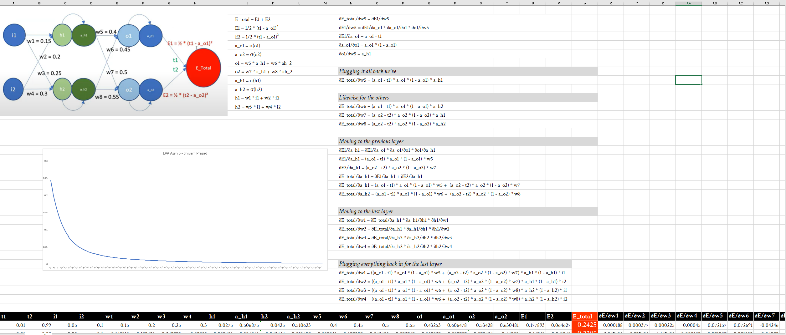
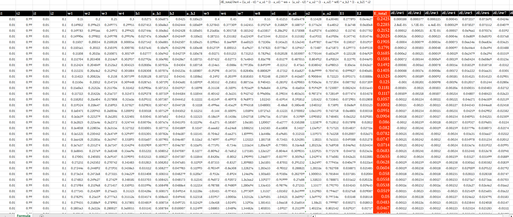
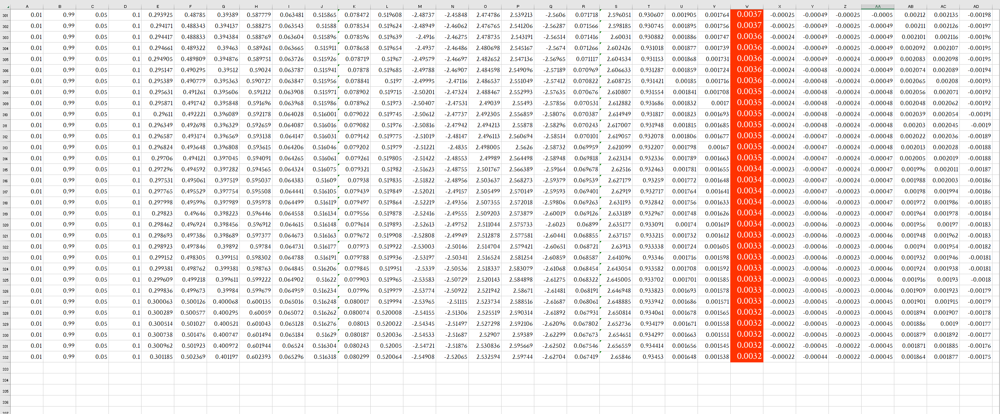
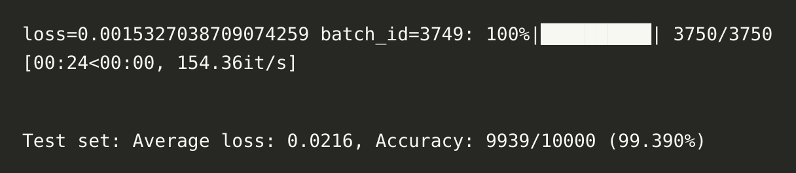
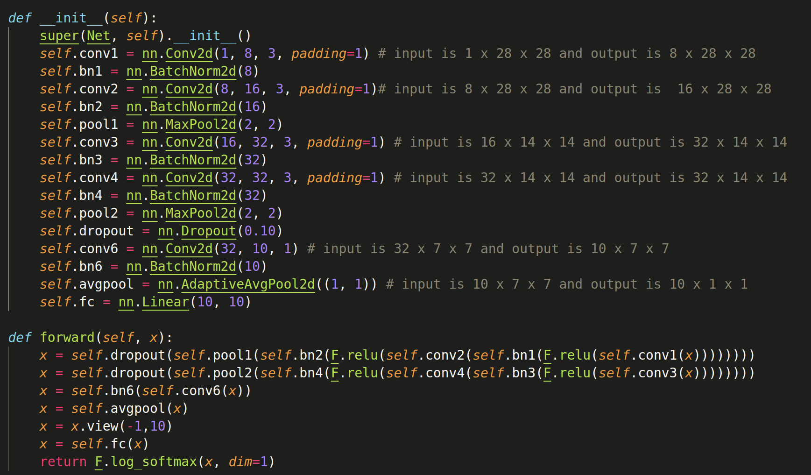

# PART 1

# PART 2

I got 99.39% validation accuracy

[Here&#39;s the notebook](EVA4_Session_3.ipynb)

## Explanation of model architecture - for 12 year olds ;)

This is a model for recognizing pictures of objects. It's made up of many small parts that work together.

First, the model takes an image, and it uses a special type of math called 'convolution' to look at small parts of the image at a time. This is done by the conv1 and conv2 layers.

Then, the model looks at the image again, but this time it groups up similar parts together, this is done by the pool1 and pool2 layers.

After that, the model makes sure that it doesn't get too excited by some specific parts of the image, this is done by dropout layer.

Then the model looks at the image again, but this time it uses another type of math called 'convolution' to look at the image in a different way, this is done by conv6 layer.

Then, the model looks at the image again but this time it takes the average of all the parts, this is done by avgpool layer.

Finally, the model uses a simple math to decide which object the image is showing, this is done by the fc layer.

To simplify, this model is composed of several layers that each one of them performs a specific task such as convolution, pooling, batch normalization, dropout and linear layers, these layers work together to recognize the objects in the images and output the class of the object.