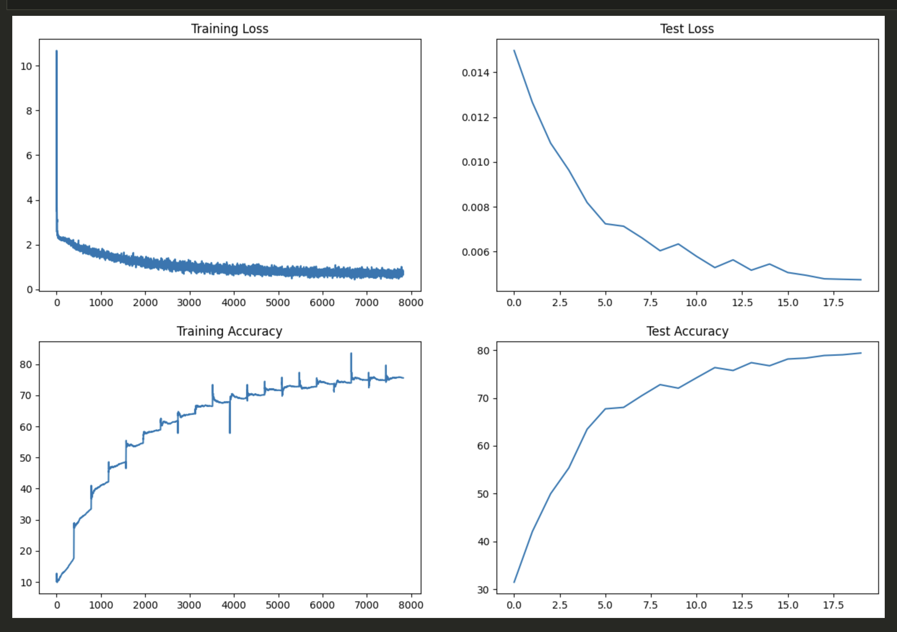
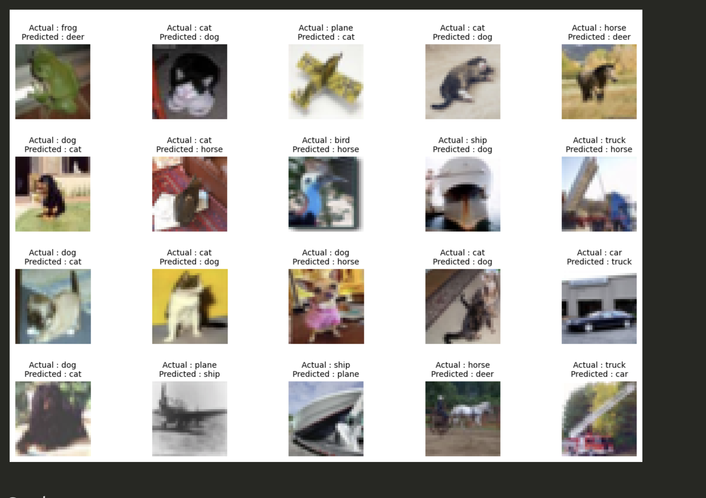
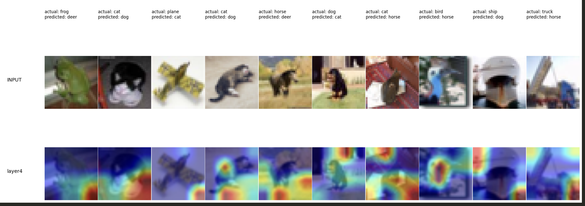

# Session 7 Assignment - Advanced Training Concepts

## EVA8 Core Utils

As required, an additional repo was created with models, utils and main files in the following location: [EVA 8 Utils](https://github.com/shivam13juna/eva8_utils.git)

## Relevant Graphs for both train and test

## Sample Misclassified Images

## GradCam Output

## Training Logs 

EPOCH: 1
Loss=1.95929753780365 Batch_id=390 LR=0.01000 Accuracy=17.64: 100%|██████████| 391/391 [00:32<00:00, 12.00it/s]  

Test set: Average loss: 0.0150, Accuracy: 3145/10000 (31.45%)

EPOCH: 2
Loss=1.6320419311523438 Batch_id=390 LR=0.01000 Accuracy=33.47: 100%|██████████| 391/391 [00:39<00:00,  9.95it/s]

Test set: Average loss: 0.0127, Accuracy: 4206/10000 (42.06%)

EPOCH: 3
Loss=1.5098916292190552 Batch_id=390 LR=0.01000 Accuracy=42.23: 100%|██████████| 391/391 [01:14<00:00,  5.24it/s]

Test set: Average loss: 0.0108, Accuracy: 4997/10000 (49.97%)

EPOCH: 4
Loss=1.3899986743927002 Batch_id=390 LR=0.01000 Accuracy=48.67: 100%|██████████| 391/391 [02:05<00:00,  3.11it/s]

Test set: Average loss: 0.0096, Accuracy: 5537/10000 (55.37%)

EPOCH: 5
Loss=1.1176763772964478 Batch_id=390 LR=0.01000 Accuracy=54.67: 100%|██████████| 391/391 [02:31<00:00,  2.59it/s]

Test set: Average loss: 0.0082, Accuracy: 6346/10000 (63.46%)

EPOCH: 6
Loss=1.0302324295043945 Batch_id=390 LR=0.01000 Accuracy=58.92: 100%|██████████| 391/391 [02:32<00:00,  2.56it/s]

Test set: Average loss: 0.0072, Accuracy: 6773/10000 (67.73%)

EPOCH: 7
Loss=0.8306522369384766 Batch_id=390 LR=0.01000 Accuracy=61.78: 100%|██████████| 391/391 [02:32<00:00,  2.56it/s]

Test set: Average loss: 0.0071, Accuracy: 6803/10000 (68.03%)

EPOCH: 8
Loss=0.921622097492218 Batch_id=390 LR=0.01000 Accuracy=64.11: 100%|██████████| 391/391 [02:32<00:00,  2.56it/s] 

Test set: Average loss: 0.0066, Accuracy: 7049/10000 (70.49%)

EPOCH: 9
Loss=0.9278275370597839 Batch_id=390 LR=0.01000 Accuracy=66.53: 100%|██████████| 391/391 [02:33<00:00,  2.55it/s]

Test set: Average loss: 0.0060, Accuracy: 7279/10000 (72.79%)

EPOCH: 10
Loss=0.797681450843811 Batch_id=390 LR=0.01000 Accuracy=67.83: 100%|██████████| 391/391 [02:38<00:00,  2.46it/s] 

Test set: Average loss: 0.0063, Accuracy: 7205/10000 (72.05%)

EPOCH: 11
Loss=0.8742387890815735 Batch_id=390 LR=0.01000 Accuracy=69.19: 100%|██████████| 391/391 [02:37<00:00,  2.48it/s]

Test set: Average loss: 0.0058, Accuracy: 7423/10000 (74.23%)

EPOCH: 12
Loss=0.8287864923477173 Batch_id=390 LR=0.01000 Accuracy=70.13: 100%|██████████| 391/391 [02:42<00:00,  2.41it/s]

Test set: Average loss: 0.0053, Accuracy: 7636/10000 (76.36%)

EPOCH: 13
Loss=0.9077366590499878 Batch_id=390 LR=0.01000 Accuracy=71.64: 100%|██████████| 391/391 [02:40<00:00,  2.43it/s]

Test set: Average loss: 0.0056, Accuracy: 7575/10000 (75.75%)

EPOCH: 14
Loss=0.8574408292770386 Batch_id=390 LR=0.01000 Accuracy=72.80: 100%|██████████| 391/391 [02:40<00:00,  2.43it/s]

Test set: Average loss: 0.0052, Accuracy: 7739/10000 (77.39%)

EPOCH: 15
Loss=0.7988139986991882 Batch_id=390 LR=0.01000 Accuracy=72.77: 100%|██████████| 391/391 [02:42<00:00,  2.41it/s]

Test set: Average loss: 0.0054, Accuracy: 7674/10000 (76.74%)

EPOCH: 16
Loss=0.617641806602478 Batch_id=390 LR=0.01000 Accuracy=73.69: 100%|██████████| 391/391 [02:41<00:00,  2.42it/s] 

Test set: Average loss: 0.0051, Accuracy: 7815/10000 (78.15%)

EPOCH: 17
Loss=0.7108274698257446 Batch_id=390 LR=0.01000 Accuracy=74.00: 100%|██████████| 391/391 [02:35<00:00,  2.52it/s]

Test set: Average loss: 0.0049, Accuracy: 7835/10000 (78.35%)

EPOCH: 18
Loss=0.8761802911758423 Batch_id=390 LR=0.01000 Accuracy=74.93: 100%|██████████| 391/391 [02:35<00:00,  2.51it/s]

Test set: Average loss: 0.0048, Accuracy: 7889/10000 (78.89%)

EPOCH: 19
Loss=0.6301823258399963 Batch_id=390 LR=0.01000 Accuracy=74.88: 100%|██████████| 391/391 [02:41<00:00,  2.42it/s] 

Test set: Average loss: 0.0048, Accuracy: 7904/10000 (79.04%)

EPOCH: 20
Loss=0.7697026133537292 Batch_id=390 LR=0.01000 Accuracy=75.60: 100%|██████████| 391/391 [02:49<00:00,  2.30it/s] 

Test set: Average loss: 0.0047, Accuracy: 7940/10000 (79.40%)