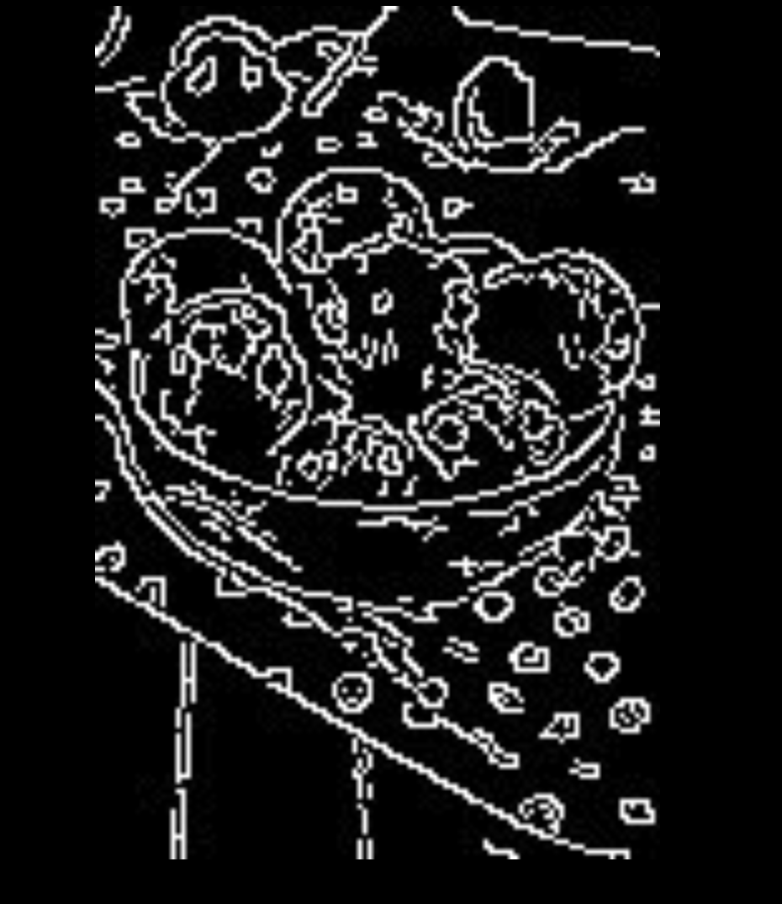
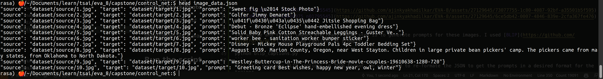
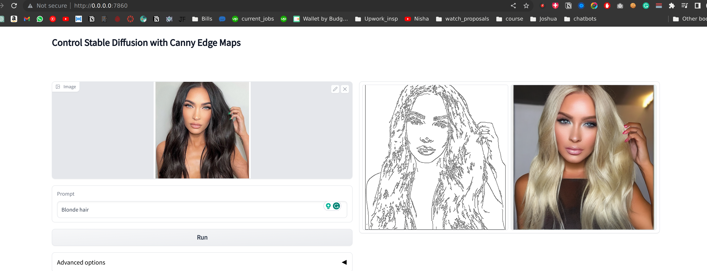
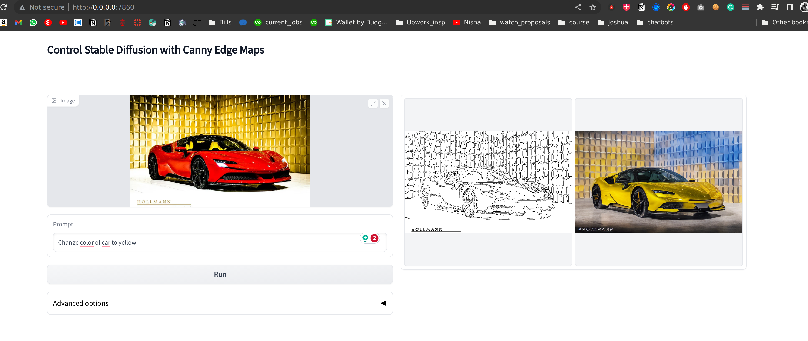

# ControlNet

Base code for control net is taken from [lllyasviel/ControlNet](https://github.com/lllyasviel/ControlNet)

I have used [Laion 4B](https://laion.ai/blog/laion-400-open-dataset/)

Definitely I haven't used entire 4 billion images, I used 10k. The image size is random, but I've resized them to 512x512.

Sample Image's canny


Actual Image 


Prompt for the same was "**Sweet fig \u2014 Stock Photo**"

I understand it's not exactly the write description, but it was good enough. 

### Run the script
For converting the script I made custom notebook for iteratively going throuh the images, renaminig them, and creating the source/target image along with the json file. 


What my image-data.json looks like
## Training the ControlNet
Most of the code for training was already present in the repo, I just had to match my dataset with the already datset loader created in the repo

I followed the link to train control net [How to train control net](https://github.com/lllyasviel/ControlNet/blob/main/docs/train.md)

#### Training Logs
I trained model for 5 epochs 

```
Epoch 0: 92% 920/1000 [4:08:40<23:06, 17.33s/it, loss=0.15, v_num=16, train/loss_simple_step=0.164, train/loss_vlb_step=0.00294, train/loss_step=0.164, global_step=919.0] Data shape for DDIM sampling is (4, 2, 64, 64), eta 0.0
Running DDIM Sampling with 58 timesteps

Epoch 1: 93% 930/1000 [4:18:18<20:09, 17.28s/it, loss=0.14, v_num=17, train/loss_simple_step=0.154, train/loss_vlb_step=0.00274, train/loss_step=0.154, global_step=929.0] Data shape for DDIM sampling is (4, 2, 64, 64), eta 0.0
Running DDIM Sampling with 60 timesteps

Epoch 2: 95% 950/1000 [4:28:32<15:30, 18.61s/it, loss=0.12, v_num=18, train/loss_simple_step=0.134, train/loss_vlb_step=0.00256, train/loss_step=0.134, global_step=949.0] Data shape for DDIM sampling is (4, 2, 64, 64), eta 0.0
Running DDIM Sampling with 62 timesteps

Epoch 3: 96% 960/1000 [4:38:11<10:06, 18.15s/it, loss=0.11, v_num=19, train/loss_simple_step=0.124, train/loss_vlb_step=0.00238, train/loss_step=0.124, global_step=959.0] Data shape for DDIM sampling is (4, 2, 64, 64), eta 0.0
Running DDIM Sampling with 65 timesteps

Epoch 4: 97% 970/1000 [4:48:45<05:45, 18.50s/it, loss=0.10, v_num=20, train/loss_simple_step=0.114, train/loss_vlb_step=0.00218, train/loss_step=0.114, global_step=969.0] Data shape for DDIM sampling is (4, 2, 64, 64), eta 0.0
Running DDIM Sampling with 70 timesteps
```

The checkpoint is after 5 epochs of training on NVidia A100 GPU.

## Result
Sample screenshot



